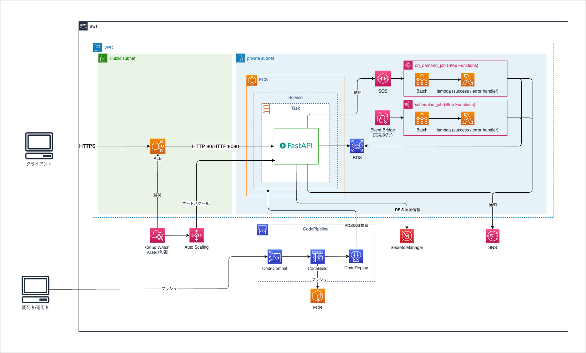

# Terraformチュートリアル

TerraformチュートリアルではECSを使った基本的な構成のアプリケーションを構築します。

- [Chapter0 - 前準備](docs/chapter_00.md)
- [Chapter1 - Terraform入門](docs/chapter_01.md)
- [Chapter2 - データベース](docs/chapter_02.md)
- [Chapter3 - バッチコンピューティング環境](docs/chapter_03.md)
- [Chapter4 - オンデマンドジョブ](docs/chapter_04.md)
- [Chapter5 - スケジュールジョブ](docs/chapter_05.md)
- [Chapter6 - ロードバランサー](docs/chapter_06.md)
- [Chapter7 - ECS](docs/chapter_07.md)
- [Chapter8 - オートスケーリング](docs/chapter_08.md)
- [Chapter9 - CICD](docs/chapter_09.md)