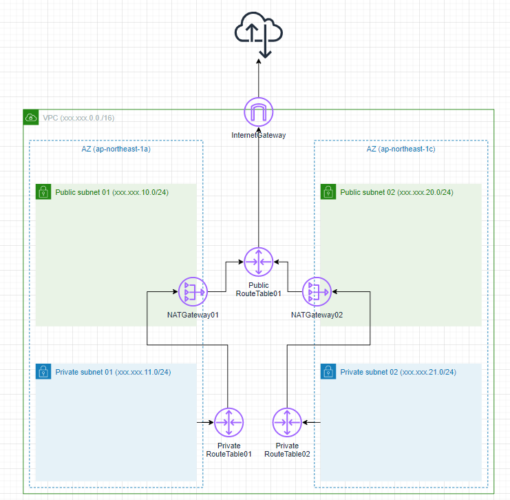
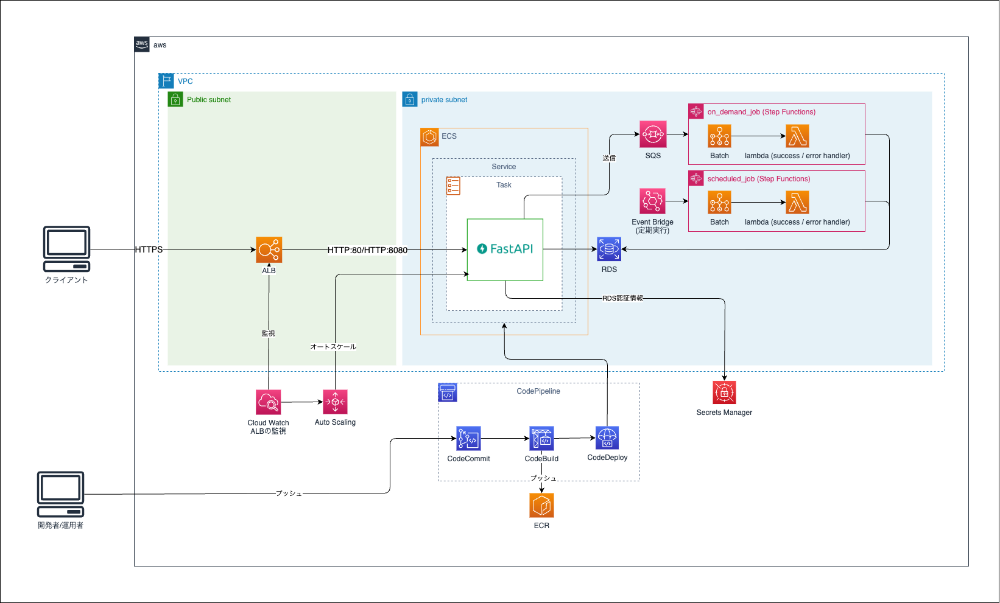
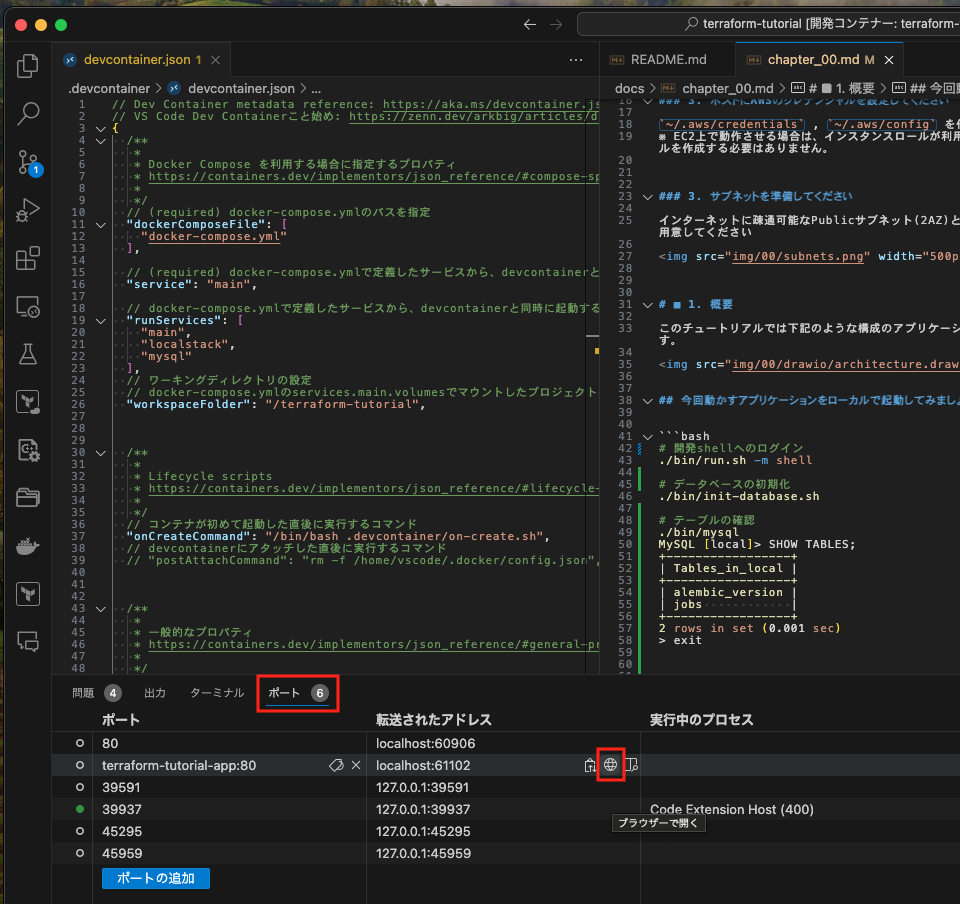
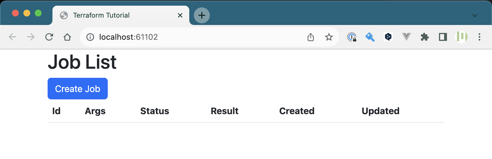
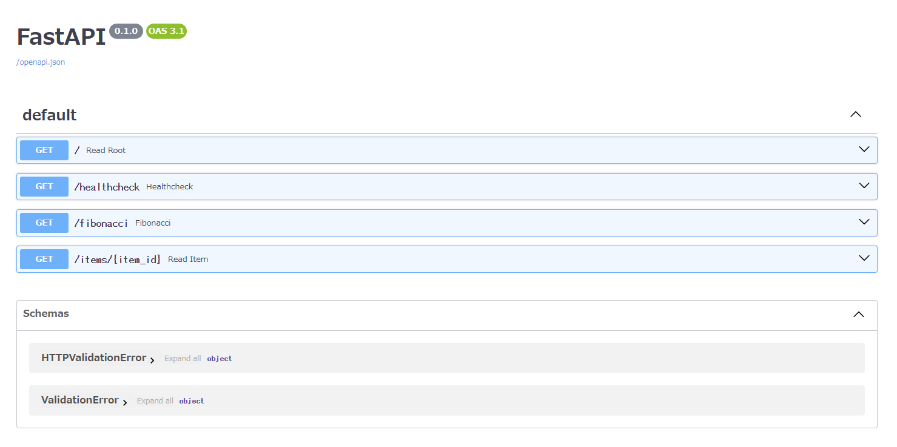

Chapter0 概要・前準備
---
[READMEに戻る](../README.md)

# ■ 0. Requirements

### 1. ホストマシンにdockerとdocker-composeをインストールしてください  

- [Install Docker Engine | docker docs](https://docs.docker.com/engine/install/)
- [Install Compose standalone ~ docker docs](https://docs.docker.com/compose/install/standalone/)

### 2. vscodeのdevcontainerを利用できるようにしておいてください

このリポジトリはvscodeのdevcontainerで操作されることを前提としています

### 3. ホストにAWSのクレデンシャルを設定してください

`~/.aws/credentials` , `~/.aws/config` を作成してください。  
※ EC2上で動作させる場合は、インスタンスロールが利用されるので、これらのファイルを作成する必要はありません。


### 3. サブネットを準備してください

インターネットに疎通可能なPublicサブネット(2AZ)とPrivateサブネット(2AZ)を用意してください




# ■ 1. 概要

このチュートリアルでは下記のような構成のアプリケーションをTerraformで作成します。




## 今回動かすアプリケーションをローカルで起動してみましょう


```bash
# 開発shellへのログイン
./bin/run.sh -m shell

# データベースの初期化
./bin/init-database.sh

# テーブルの確認
./bin/mysql.sh
MySQL [local]> SHOW TABLES;
+-----------------+
| Tables_in_local |
+-----------------+
| alembic_version |
| jobs            |
+-----------------+
2 rows in set (0.001 sec)
> exit


# 開発shellからのログアウト
exit

# アプリの起動
./bin/run.sh
```

アプリが起動したら、ポートフォワーディングの画面を開き、 `terraform-tutorialapp:80` が転送されているアドレスの地球儀アイコンをクリックしてみましょう。



下記の画面が表示されればOKです。




`/docs` にアクセスすると、FastAPIの画面が表示されます。




# ■ 2. 前準備

アプリケーションのデプロイに必要なリソースを作成しておきましょう。  
※ インターネットに疎通可能なPublicサブネット(2AZ)とPrivateサブネット(2AZ)は存在する前提です。


```bash
# 変数定義
STAGE=dev
AWS_ACCOUNT_ID=$(aws sts get-caller-identity --query "Account" --output text)
AWS_REGION="ap-northeast-1"

# 確認
echo $STAGE $AWS_ACCOUNT_ID $AWS_REGION
```

## ECRリポジトリの作成 ~ プッシュ

アプリケーションのイメージを保存するECRリポジトリを作成します。

```bash
REPOSITORY_NAME="terraform-tutorial/${STAGE}/app"

# リポジトリ作成
aws ecr create-repository --repository-name $REPOSITORY_NAME

# イメージのビルド
docker build --rm -f docker/app/Dockerfile -t ${REPOSITORY_NAME}:latest .

# ECRにログイン
aws ecr get-login-password --region $AWS_REGION | docker login --username AWS --password-stdin ${AWS_ACCOUNT_ID}.dkr.ecr.${AWS_REGION}.amazonaws.com

# ECRにイメージをpush
REMOTE_REPOSITORY_NAME=${AWS_ACCOUNT_ID}.dkr.ecr.${AWS_REGION}.amazonaws.com/${REPOSITORY_NAME}:latest
docker tag ${REPOSITORY_NAME}:latest $REMOTE_REPOSITORY_NAME
docker push $REMOTE_REPOSITORY_NAME
```

# ■ tfstate管理用s3バケット作成

terraformのtfstateを管理するS3バケットを作成します。

```bash
# tfstateファイルをS3で管理する
# https://developer.hashicorp.com/terraform/language/settings/backends/s3
TFSTATE_BUCKET="xxxxxxxxxxxxxxxxx"

aws s3api create-bucket \
  --bucket $TFSTATE_BUCKET \
  --region $AWS_REGION \
  --create-bucket-configuration LocationConstraint=$AWS_REGION

```

# ■ tfstateロック用のdynamodbテーブルを作成

terraformを複数個所から同時にデプロイできないように、dynamoDBにtfstateをロックするためのテーブルを作成します。

```bash
# tfstateファイルのロック情報をDynamoDBで管理する
# https://developer.hashicorp.com/terraform/language/settings/backends/s3#dynamodb-state-locking

TFSTATE_LOCK_TABLE="xxxxxxxxxxxxxxxxx"

aws dynamodb create-table \
    --table-name $TFSTATE_LOCK_TABLE \
    --attribute-definitions AttributeName=LockID,AttributeType=S \
    --key-schema AttributeName=LockID,KeyType=HASH \
    --provisioned-throughput ReadCapacityUnits=5,WriteCapacityUnits=5 \
    --region $AWS_REGION
```

# ■ CICD用アーティファクト保存バケット作成

「Chapter9 CICD」で作成するCodePipelineのアーティファクトを保存するためのバケットを作成します。

```bash
CICD_BUCKET="xxxxxxxxxxxxxxxxx"

aws s3api create-bucket \
  --bucket $CICD_BUCKET \
  --region $AWS_REGION \
  --create-bucket-configuration LocationConstraint=$AWS_REGION
```

# ■ CodeCommitにCICDの起点となるリポジトリを作成

※ 手順ではHTTPSでpushしていますが、sshでpushしてもかまいません

- 参考
  - [Linux、macOS、または Unix での AWS CodeCommit リポジトリへの SSH 接続の設定手順 | AWS](https://docs.aws.amazon.com/ja_jp/codecommit/latest/userguide/setting-up-ssh-unixes.html)
  - [AWS CLI 認証情報ヘルパーを使用した、Linux、macOS、または UNIX での AWS CodeCommit リポジトリへの HTTPS 接続のセットアップ手順 | AWS](https://docs.aws.amazon.com/ja_jp/codecommit/latest/userguide/setting-up-https-unixes.html)


```bash
REPOSITORY_NAME="terraform-tutorial"

# リポジトリの作成
aws codecommit create-repository \
  --repository-name $REPOSITORY_NAME

# 認証情報ヘルパーを設定
git config --global credential.helper '!aws codecommit credential-helper $@'
git config --global credential.UseHttpPath true

# リポジトリURL (HTTPS) を取得
REPOSITORY_URL_HTTP=$(aws codecommit get-repository --repository-name $REPOSITORY_NAME | jq -r ".repositoryMetadata.cloneUrlHttp")

# リモートリポジトリの登録
git remote add codecommit $REPOSITORY_URL_HTTP

# プッシュ
git push codecommit main
```