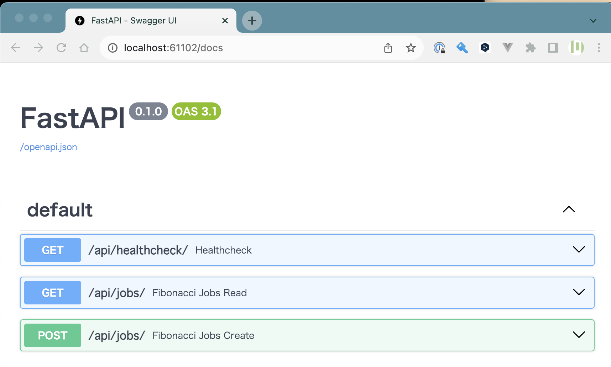

Chapter0 概要・前準備
---
[READMEに戻る](../README.md)

# ■ 0. Requirements

### 1. ホストマシンにdockerをインストールしてください  

[Install Docker Engine | docker docs](https://docs.docker.com/engine/install/)

### 2. vscodeのdevcontainerを利用できるようにしておいてください

このリポジトリはvscodeのdevcontainerで操作されることを前提としています

### 3. ホストにAWSのクレデンシャルを設定してください

`~/.aws/credentials` , `~/.aws/config` を作成してください。  
※ EC2上で動作させる場合は、インスタンスロールが利用されるので、これらのファイルを作成する必要はありません。


### 3. サブネットを準備してください

インターネットに疎通可能なPublicサブネット(2AZ)とPrivateサブネット(2AZ)を用意してください


# ■ 1. 概要

このチュートリアルでは下記のような構成のアプリケーションをTerraformで作成します。


## 今回動かすアプリケーションをローカルで起動してみましょう


```bash
# データベースの初期化
./bin/run.sh -m shell
./bin/init-database.sh
exit

# アプリの起動
./bin/run.sh
```

ブラウザで http://localhost/docs にアクセスしてみましょう。  
下記のようなFastAPIの画面が表示されるはずです。



APIの確認ができたら、 http://localhost/ にアクセスしてアプリを操作してみましょう。


# ■ 2. 前準備

アプリケーションのデプロイに必要なリソースを作成しておきましょう。  
※ インターネットに疎通可能なPublicサブネット(2AZ)とPrivateサブネット(2AZ)は存在する前提です。


```bash
# 変数定義
STAGE=dev
AWS_ACCOUNT_ID=$(aws sts get-caller-identity --query "Account" --output text)
AWS_REGION="ap-northeast-1"
```

## ECRリポジトリの作成 ~ プッシュ

アプリケーションのイメージを保存するECRリポジトリを作成します。

```bash
REPOSITORY_NAME="terraform-tutorial/${STAGE}/app"

# リポジトリ作成
aws ecr create-repository --repository-name $REPOSITORY_NAME


# イメージのビルド
docker build --rm -f docker/app/Dockerfile -t ${REPOSITORY_NAME}:latest .

# ECRにログイン
aws ecr get-login-password --region $AWS_REGION | docker login --username AWS --password-stdin ${AWS_ACCOUNT_ID}.dkr.ecr.${AWS_REGION}.amazonaws.com

# ECRにイメージをpush
REMOTE_REPOSITORY_NAME=${AWS_ACCOUNT_ID}.dkr.ecr.${AWS_REGION}.amazonaws.com/${REPOSITORY_NAME}:latest
docker tag ${REPOSITORY_NAME}:latest $REMOTE_REPOSITORY_NAME
docker push $REMOTE_REPOSITORY_NAME
```

# ■ tfstate管理用s3バケット作成

terraformのtfstateを管理するS3バケットを作成します。

```bash
# tfstateファイルをS3で管理する
# https://developer.hashicorp.com/terraform/language/settings/backends/s3
TFSTATE_BUCKET="xxxxxxxxxxxxxxxxx"

aws s3api create-bucket \
  --bucket $TFSTATE_BUCKET \
  --region $AWS_REGION \
  --create-bucket-configuration LocationConstraint=$AWS_REGION

```

# ■ tfstateロック用のdynamodbテーブルを作成

terraformを複数個所から同時にデプロイできないように、dynamoDBにtfstateをロックするためのテーブルを作成します。

```bash
# tfstateファイルのロック情報をDynamoDBで管理する
# https://developer.hashicorp.com/terraform/language/settings/backends/s3#dynamodb-state-locking

TFSTATE_LOCK_TABLE="xxxxxxxxxxxxxxxxx"

aws dynamodb create-table \
    --table-name $TFSTATE_LOCK_TABLE \
    --attribute-definitions AttributeName=LockID,AttributeType=S \
    --key-schema AttributeName=LockID,KeyType=HASH \
    --provisioned-throughput ReadCapacityUnits=5,WriteCapacityUnits=5 \
    --region $AWS_REGION
```

# ■ CICD用アーティファクト保存バケット作成

```bash
CICD_BUCKET="xxxxxxxxxxxxxxxxx"

aws s3api create-bucket \
  --bucket $CICD_BUCKET \
  --region $AWS_REGION \
  --create-bucket-configuration LocationConstraint=$AWS_REGION
```

# ■ CodeCommitにCICDの起点となるリポジトリを作成


```bash
REPOSITORY_NAME="terraform-tutorial"

aws codecommit create-repository \
  --repository-name $REPOSITORY_NAME

# リポジトリ情報を取得
aws codecommit get-repository \
  --repository-name $REPOSITORY_NAME

# リモートリポジトリの登録
git remote add codecommit リモートリポジトリのURL

# プッシュ
git push codecommit main
```

# ■ サンプルのデプロイ (やりたい人だけ)

完成サンプルをデプロイしてみたい方はこちらのコマンドで試してみてください。

```bash
cd terraform-sample/envs/dev
terraform init
terraform plan
terraform apply -auto-approve
```

リソースの削除

```bash
cd terraform-sample/envs/dev

# すべて削除
terraform destroy

# アプリリソースのみ削除
terraform destroy -target=module.app
```