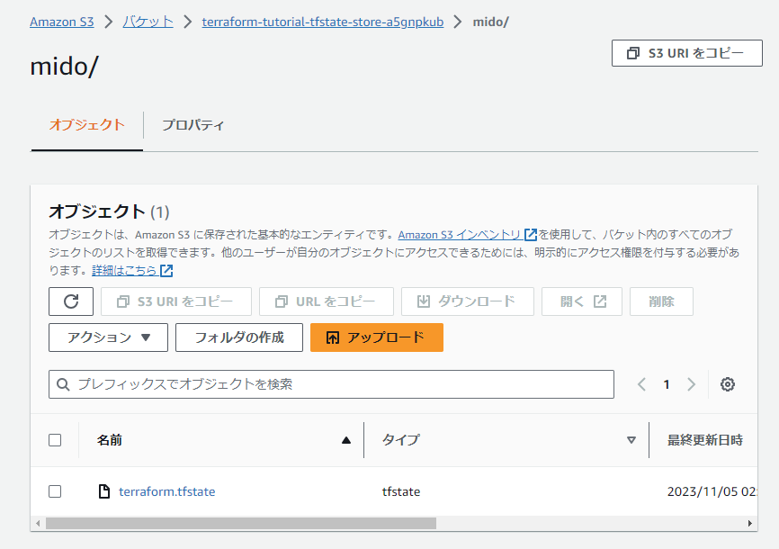
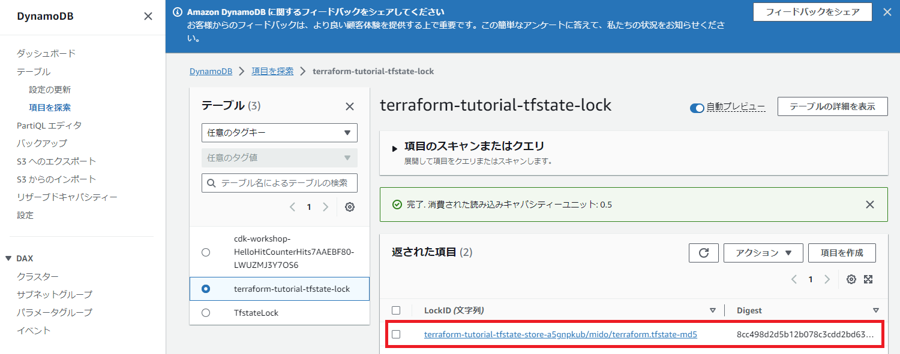

Chapter1 Terraform入門
---
[READMEに戻る](../README.md)


# ■ 0. Terraform入門

このチュートリアルではTerraform自体をどう利用するのかは説明しません。  
Terraform自体の説明は下記を参考にしてみてください。

- [それ、どこに出しても恥ずかしくない Terraformコードになってるか？ | AWS](https://esa-storage-tokyo.s3-ap-northeast-1.amazonaws.com/uploads/production/attachments/5809/2023/07/07/19598/c89126e6-8d48-4e34-a654-6fd29b63756e.pdf)
- 公式ドキュメント
  - [Providers](https://developer.hashicorp.com/terraform/language/providers)  
  - [Resources](https://developer.hashicorp.com/terraform/language/resources)  
    インフラオブジェクトを記述するためのブロック。
    - [Meta-Arguments](https://developer.hashicorp.com/terraform/language/meta-arguments/depends_on)  
    depends_on, count, for_each, lifecycleなどどのリソースでも共通で利用できるパラメータに関する説明
  - [Data Sources](https://developer.hashicorp.com/terraform/language/data-sources)  
  - [Variable and Outputs](https://developer.hashicorp.com/terraform/language/values)  
  variable, output, locals など変数定義や出力で利用するブロック
  - [Modules](https://developer.hashicorp.com/terraform/language/modules)  
  複数リソースをまとめるための仕組み
  - [Functions](https://developer.hashicorp.com/terraform/language/functions)  
  Terraform内で利用できる組み込み関数


## 利用する主なコマンド

```bash
# プロバイダプラグインのインストールなど、terraformコマンドを利用するための初期化処理を行うコマンド
terraform init

# 組み込み関数などの動作確認を行えるプロンプトを立ち上げるコマンド
# 例)
# > replace("hoge-fuga", "-", "_")
# "hoge_fuga"
terraform console


# 構文が正しいかのバリデーションを行うコマンド
terraform validate

# tfファイルのフォーマットを行うコマンド
#   -recursive: 再帰的にフォーマットできる
terraform fmt

# 現在のデプロイ状況と比較し、どんなリソースが作成(削除)されるかを確認するコマンド
terraform plan

# 定義したリソースをデプロイするコマンド
#   -auto-approve: インタラクティブな確認をスキップできる
#   -target=path.to.resource: 指定したリソースのみデプロイできる
terraform apply

# 定義したリソースを削除するコマンド
#   -auto-approve: インタラクティブな確認をスキップできる
#   -target=path.to.resource: 指定したリソースのみ削除できる
terraform destroy
```


# ■ 1. ディレクトリ作成

terraformリソースは `terraform/` ディレクトリ配下に定義します。

## ディレクトリ構成

- `terraform/`
  - `envs/`
    dev, stg, prd など、環境毎にディレクトリを切る
  - `modules/`
    サービス毎・ライフサイクル毎にある程度リソースをグループ化したモジュールを配置

```bash
# 半角英数字のみ
ENV_NAME="xxxxx"

# プロジェクトディレクトリ作成
mkdir -p "terraform/envs/${ENV_NAME}" "terraform/modules"
```

## .gitignore配置

```bash
cat <<EOF > terraform/.gitignore
# Local .terraform directories
**/.terraform/*

# .tfstate files
*.tfstate
*.tfstate.*

# Crash log files
crash.log
crash.*.log

# Exclude all .tfvars files, which are likely to contain sensitive data, such as
# password, private keys, and other secrets. These should not be part of version 
# control as they are data points which are potentially sensitive and subject 
# to change depending on the environment.
*.tfvars
*.tfvars.json

# Ignore override files as they are usually used to override resources locally and so
# are not checked in
override.tf
override.tf.json
*_override.tf
*_override.tf.json

# Include override files you do wish to add to version control using negated pattern
# !example_override.tf

# Include tfplan files to ignore the plan output of command: terraform plan -out=tfplan
# example: *tfplan*

# Ignore CLI configuration files
.terraformrc
terraform.rc

**/*.auto.tfvars
EOF
```

# ■ 2. プロバイダの設定

今回作成するリソースはすべてAWSのリソースであるため、 `hashicorp/aws` プロバイダプラグインをインストールして、それを利用できるように設定していきます。  
terraformではデプロイ状況を `terraform.tfstate` というファイルで管理しますが、デフォルトだとこのファイルはローカルに生成されてしまうため、s3バケットに保存するように設定します。  
また、terraformでは環境に対して同時に操作を行うと環境が壊れてしまうため、 `terraform.tfstate` にロック機構を設けることで環境に同時に操作が行われることを防止します。このロックはDynamoDBで管理します。


`terraform/envs/${ENV_NAME}/main.tf`

```hcl
terraform {
  // 必要なプロバイダを定義
  required_providers {
    // AWS Provider: https://registry.terraform.io/providers/hashicorp/aws/latest/docs
    aws = {
      source  = "hashicorp/aws"
      version = "~> 5.0"
    }
  }

  // terraformのバージョン指定
  required_version = ">= 1.2.0"

  // tfstateファイルをs3で管理する: https://developer.hashicorp.com/terraform/language/settings/backends/s3
  backend "s3" {
    // tfstate保存先のs3バケットとキー
    bucket  = "xxxxxxxxxxxxxxxx"  // TODO: chapter0 で作成した "tfstate管理用s3バケット" を指定
    region  = "ap-northeast-1"
    key     = "path/to/terraform.tfstate"  // TODO: tfstate保存先パスを指定
    encrypt = true
    // tfstateファイルのロック情報をDynamoDBで管理する: https://developer.hashicorp.com/terraform/language/settings/backends/s3#dynamodb-state-locking
    dynamodb_table = "xxxxxxxxxxxx"  // TODO: chapter0 で作成した "tfstateロック用のdynamodbテーブル" を指定
  }
}

provider "aws" {
  region = "ap-northeast-1"

  // すべてのリソースにデフォルトで設定するタグ
  default_tags {
    tags = {
      PROJECT_NAME = "TERRAFORM_TUTORIAL_D"
    }
  }
}

// Data Source: aws_caller_identity: https://registry.terraform.io/providers/hashicorp/aws/latest/docs/data-sources/caller_identity
// Terraformが認可されているアカウントの情報を取得するデータソース
data "aws_caller_identity" "self" {}

// Data Source: aws_region: https://registry.terraform.io/providers/hashicorp/aws/latest/docs/data-sources/region
// 現在のリージョンを取得するデータソース
data "aws_region" "current" {}
```


# ■ terraformデプロイ

現時点ではリソースは作成されませんが、一度デプロイと削除を試してみましょう。

```bash
cd terraform/envs/${ENV_NAME}

# 初期化
terraform init

# デプロイ内容確認
terraform plan

# 作成
terraform apply -auto-approve
```

tfstateが指定したs3バケットの指定されたキーに作成されているかを確認してみましょう。




DynamoDBにtfstateのロックレコードが生成されていることを確認してみましょう。




```bash
# 削除
terraform destroy -auto-approve
```