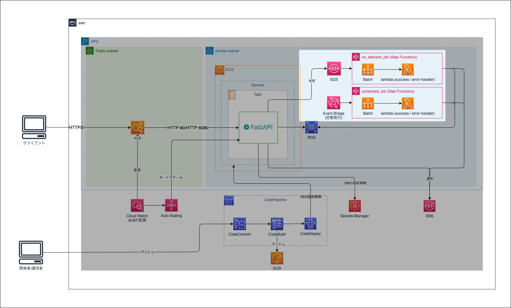

Chapter3 ECS
---
[READMEに戻る](../README.md)

# ■ 1. 作るもの

この章ではECSを作成します。



# ■ 2. モジュールの作成

ECSリソースを定義する `app` モジュールを定義します。

```bash
mkdir -p terraform terraform/modules/app
(cd terraform/modules/app; touch main.tf variables.tf outputs.tf iam.tf)
```

# ■ 3. 入力値・出力値の定義

`terraform/modules/app/variables.tf`

```hcl
variable "app_name" {}
variable "stage" {}
variable "account_id" {}

// ECSタスクのコンテナイメージのURI
variable "app_image_uri" {}

// ECSのセキュリティグループ・ALBのターゲットグループを作成するVPC
variable "vpc_id" {}

// ECSタスクを起動するサブネット
variable "subnets" { type = list(string) }

// ECSのセキュリティグループで許可するCIDRブロック
variable "ingress_cidr_blocks" {
  type = list(string)
}

// ALBのARN
variable "app_alb_arn" {}

// コンテナの環境変数
variable "env" { type = map(any) }

// HTTPSでアクセスする場合のSSL証明書のARN
variable "certificate_arn" {
  type        = string
  default     = ""
  description = "SSL証明書のARN。空文字の場合はHTTPのリスナーを作成する"
}

locals {
  // certificate_arnが指定されていたら "1"
  use_https_listener = length(var.certificate_arn) > 0 ? "1" : "0"
  // certificate_arnが指定されていたら "0"
  use_http_listener  = length(var.certificate_arn) <= 0 ? "1" : "0"
  container_name     = "app"  // コンテナ名
  container_port     = 80  // コンテナのポート番号
}
```

`terraform/modules/app/outputs.tf`

```tf
output "ecs_cluster_name" {
  value = aws_ecs_cluster.app_cluster.name
}

output "ecs_service_name" {
  value = aws_ecs_service.app_service.name
}

output "ecs_task_family" {
  value = aws_ecs_task_definition.app_task_definition.family
}

output "ecs_task_revision" {
  value = aws_ecs_task_definition.app_task_definition.revision
}


output "esc_task_definition_arn" {
  value = aws_ecs_task_definition.app_task_definition.arn
}

output "tg_1" {
  value = aws_lb_target_group.app_tg_1
}

output "tg_2" {
  value = aws_lb_target_group.app_tg_2
}

output "listener_green" {
  # countを利用したリソースはlistになるので、インデックスを指定する
  value = length(var.certificate_arn) > 0 ? aws_lb_listener.app_listener_green_https.0 : aws_lb_listener.app_listener_green_http.0
}

output "listener_blue" {
  value = aws_lb_listener.app_listener_blue
}

output "container_name" {
  value = local.container_name
}

output "container_port" {
  value = local.container_port
}
```

# ■ 4. リソース定義


## ALBのターゲットグループ・リスナー

Blue/Greenデプロイを利用するため、本番用のリスナーとテスト用の2つのリスナーを作成します。
HTTPSの利用の有無で作成するリスナーが異なります。

- HTTPSを利用する
  - `HTTPS:443`  
  ターゲット: 本番用のECSコンテナ
  - `HTTP:80` :  
  ターゲット: `HTTPS:443` にリダイレクト
  - `HTTP:8080`  
  ターゲット: テスト用のECSコンテナ
- HTTPSを利用しない
  - `HTTP:80` :  
  ターゲット: 本番用のECSコンテナ
  - `HTTP:8080`  
  ターゲット: テスト用のECSコンテナ


`terraform/modules/app/main.tf`

```hcl
/**
 * ALBターゲットグループ
 * aws_lb_target_group: https://registry.terraform.io/providers/hashicorp/aws/latest/docs/resources/lb_target_group
 */

// 本番用リスナーにアタッチするターゲットグループ
resource "aws_lb_target_group" "app_tg_1" {
  name        = "${var.app_name}-${var.stage}-app-tg-1"
  port        = "80"
  protocol    = "HTTP"
  target_type = "ip"
  vpc_id      = var.vpc_id

  health_check {
    interval            = 30
    timeout             = 5
    healthy_threshold   = 3
    unhealthy_threshold = 3
    path                = "/healthcheck"
    protocol            = "HTTP"
    matcher             = "200"
  }

  tags = {
    Name = "${var.app_name}-${var.stage}-app-tg-1"
  }
}

// テスト用リスナーにアタッチするターゲットグループ
resource "aws_lb_target_group" "app_tg_2" {
  name        = "${var.app_name}-${var.stage}-app-tg-2"
  port        = "80"
  protocol    = "HTTP"
  target_type = "ip"
  vpc_id      = var.vpc_id

  health_check {
    interval            = 30
    timeout             = 5
    healthy_threshold   = 3
    unhealthy_threshold = 3
    path                = "/healthcheck"
    protocol            = "HTTP"
    matcher             = "200"
  }

  tags = {
    Name = "${var.app_name}-${var.stage}-app-tg-2"
  }
}

/**
 * ALBのリスナー (HTTPS を利用する場合)
 * aws_lb_listener: https://registry.terraform.io/providers/hashicorp/aws/latest/docs/resources/lb_listener
 */
// HTTPS:443 本番用リスナー (Green)
resource "aws_lb_listener" "app_listener_green_https" {
  // use_https_listener = "1" のときのみ作成
  // Terraformでcountをifのように使う: https://qiita.com/mia_0032/items/978449a06699ed1abe15
  count             = local.use_https_listener
  load_balancer_arn = var.app_alb_arn
  port              = "443"
  protocol          = "HTTPS"
  ssl_policy        = "ELBSecurityPolicy-2016-08"
  certificate_arn   = var.certificate_arn

  default_action {
    type = "forward"
    forward {
      target_group {
        arn    = aws_lb_target_group.app_tg_1.arn
        weight = 1
      }
    }
  }
  lifecycle {
    ignore_changes = [
      certificate_arn,
      default_action
    ]
  }
}

// HTTP:80 本番用リスナー (HTTPS:443 にリダイレクト)
resource "aws_lb_listener" "app_listener_redirect" {
  // use_https_listener = "1" のときのみ作成
  count             = local.use_https_listener
  load_balancer_arn = var.app_alb_arn
  port              = "80"
  protocol          = "HTTP"

  default_action {
    type = "redirect"

    redirect {
      port        = "443"
      protocol    = "HTTPS"
      status_code = "HTTP_301"
    }
  }
  lifecycle {
    ignore_changes = [
      default_action
    ]
  }
}

/**
 * ALBのリスナー (HTTP を利用する場合)
 * aws_lb_listener: https://registry.terraform.io/providers/hashicorp/aws/latest/docs/resources/lb_listener
 */

 // HTTP:80 本番用用リスナー (Green)
resource "aws_lb_listener" "app_listener_green_http" {
  // use_http_listener = "1" のときのみ作成
  count             = local.use_http_listener
  load_balancer_arn = var.app_alb_arn
  port              = "80"
  protocol          = "HTTP"

  default_action {
    type = "forward"
    forward {
      target_group {
        arn    = aws_lb_target_group.app_tg_1.arn
        weight = 1
      }
    }
  }
  lifecycle {
    ignore_changes = [
      default_action
    ]
  }
}


/**
 * HTTPS/HTTP共通のALBリスナー
 * aws_lb_listener: https://registry.terraform.io/providers/hashicorp/aws/latest/docs/resources/lb_listener
 */
// HTTP:8080 テスト用リスナー (Blue)
resource "aws_lb_listener" "app_listener_blue" {
  load_balancer_arn = var.app_alb_arn
  port              = "8080"
  protocol          = "HTTP"

  default_action {
    type = "forward"
    forward {
      target_group {
        arn    = aws_lb_target_group.app_tg_2.arn
        weight = 1
      }
    }
  }
  lifecycle {
    ignore_changes = [
      default_action
    ]
  }
}
```

## ECSクラスター

最低1コンテナだけは `FARGATE` で、中断されることがないリソースとして構築し、 スケールアウトされたコンテナは中断される可能性がある `FARGATE_SPOT` を優先します。

`terraform/modules/app/main.tf`

```hcl
/**
 * ECSクラスター
 * aws_ecs_cluster: https://registry.terraform.io/providers/hashicorp/aws/latest/docs/resources/ecs_cluster
 */
resource "aws_ecs_cluster" "app_cluster" {
  name = "${var.app_name}-${var.stage}-app"

  setting {
    // CloudWatch Container Insights を有効化
    name  = "containerInsights"
    value = "enabled"
  }
}

// aws_ecs_cluster_capacity_providers: https://registry.terraform.io/providers/hashicorp/aws/latest/docs/resources/ecs_cluster_capacity_providers
resource "aws_ecs_cluster_capacity_providers" "app_cluster_capacity_providers" {
  cluster_name = aws_ecs_cluster.app_cluster.name

  capacity_providers = ["FARGATE", "FARGATE_SPOT"]

  default_capacity_provider_strategy {
    base              = 1 // 指定されたキャパシティプロバイダ上で実行するタスクの最小数
    weight            = 1 // 指定されたキャパシティプロバイダを使用すべきタスク総数の割合
    capacity_provider = "FARGATE"
  }

  default_capacity_provider_strategy {
    weight            = 2               // FARGATE_SPOTの方が優先される
    capacity_provider = "FARGATE_SPOT"  // タスクが中断される可能性があるが、コストが安い
  }
}
```

## ECSタスク定義

タスクロールとタスク実行ロールの定義

`terraform/modules/app/iam.tf`

```hcl
/**
 * タスク実行ロール
 */
resource "aws_iam_role" "ecs_task_execution_role" {
  name = "${var.app_name}-${var.stage}-EcsTaskExecutionRole"
  assume_role_policy = jsonencode({
    "Version" : "2012-10-17",
    "Statement" : [
      {
        "Effect" : "Allow",
        "Principal" : {
          "Service" : "ecs-tasks.amazonaws.com",
        },
        "Action" : "sts:AssumeRole",
      }
    ]
  })
}

resource "aws_iam_role_policy_attachment" "attach_ecs_task_execution_role_policy" {
  role       = aws_iam_role.ecs_task_execution_role.name
  policy_arn = "arn:aws:iam::aws:policy/service-role/AmazonECSTaskExecutionRolePolicy"
}

# BlueGreenDeployに必要な権限
# https://docs.aws.amazon.com/ja_jp/AmazonECS/latest/developerguide/deployment-type-bluegreen.html#deployment-type-bluegreen-IAM
resource "aws_iam_policy" "blue_green_deploy_policy" {
  name = "${var.app_name}-${var.stage}-BlueGreenDeployPolicy"
  policy = jsonencode({
    "Version" : "2012-10-17",
    "Statement" : [
      {
        "Effect" : "Allow",
        "Action" : [
          "codedeploy:CreateApplication",
          "codedeploy:CreateDeployment",
          "codedeploy:CreateDeploymentGroup",
          "codedeploy:GetApplication",
          "codedeploy:GetDeployment",
          "codedeploy:GetDeploymentGroup",
          "codedeploy:ListApplications",
          "codedeploy:ListDeploymentGroups",
          "codedeploy:ListDeployments",
          "codedeploy:StopDeployment",
          "codedeploy:GetDeploymentTarget",
          "codedeploy:ListDeploymentTargets",
          "codedeploy:GetDeploymentConfig",
          "codedeploy:GetApplicationRevision",
          "codedeploy:RegisterApplicationRevision",
          "codedeploy:BatchGetApplicationRevisions",
          "codedeploy:BatchGetDeploymentGroups",
          "codedeploy:BatchGetDeployments",
          "codedeploy:BatchGetApplications",
          "codedeploy:ListApplicationRevisions",
          "codedeploy:ListDeploymentConfigs",
          "codedeploy:ContinueDeployment",
          "sns:ListTopics",
          "cloudwatch:DescribeAlarms",
          "lambda:ListFunctions"
        ],
        "Resource" : [
          "*"
        ]
      }
    ]
  })
}

resource "aws_iam_role_policy_attachment" "attach_blue_green_deploy_policy" {
  role       = aws_iam_role.ecs_task_execution_role.name
  policy_arn = aws_iam_policy.blue_green_deploy_policy.arn
}

/**
 * タスクロール
 */
resource "aws_iam_role" "ecs_task_role" {
  name = "${var.app_name}-${var.stage}-EcsTaskRole"
  assume_role_policy = jsonencode({
    "Version" : "2012-10-17",
    "Statement" : [
      {
        "Effect" : "Allow",
        "Principal" : {
          "Service" : "ecs-tasks.amazonaws.com",
        },
        "Action" : "sts:AssumeRole",
      }
    ]
  })
}

resource "aws_iam_policy" "ecs_task_policy" {
  name = "${var.app_name}-${var.stage}-EcsTaskPolicy"
  policy = jsonencode({
    "Version" : "2012-10-17",
    "Statement" : [
      {
        "Effect" : "Allow",
        "Action" : [
          "secretsmanager:GetSecretValue",
          "secretsmanager:DescribeSecret"
        ],
        "Resource" : [
          "arn:aws:secretsmanager:ap-northeast-1:${var.account_id}:secret:/${var.app_name}/*"
        ]
      }
    ]
  })
}

resource "aws_iam_role_policy_attachment" "attach_ecs_task_role_policy" {
  role       = aws_iam_role.ecs_task_role.name
  policy_arn = aws_iam_policy.ecs_task_policy.arn
}
```

`terraform/modules/app/main.tf`

```hcl
/**
 * ロググループ
 * aws_cloudwatch_log_group: https://registry.terraform.io/providers/hashicorp/aws/latest/docs/resources/cloudwatch_log_group
 */
resource "aws_cloudwatch_log_group" "ecs_task_app_log_group" {
  name              = "${var.app_name}/${var.stage}/app/ecs-task"
  retention_in_days = 365  // 保持期間
}

/**
 * タスク定義
 * aws_ecs_task_definition: https://registry.terraform.io/providers/hashicorp/aws/latest/docs/resources/ecs_task_definition
 */
resource "aws_ecs_task_definition" "app_task_definition" {
  family = "${var.app_name}-${var.stage}-app"

  // タスクが必要とする起動タイプ
  requires_compatibilities = ["FARGATE"]

  // タスクサイズ:
  //   タスクが利用する CPU および メモリの合計量。(FARGATEの場合は必須)
  //   container_definitions で定義したコンテナのCPUとメモリの合計値を指定メモリ
  //   cpuとmemoryの値にはペアがあるので注意
  //   - https://docs.aws.amazon.com/ja_jp/AmazonECS/latest/developerguide/task_definition_parameters.html#task_size
  cpu    = 512  // 0.5vCPU
  memory = 1024 // 1GB

  // ネットワークモード:
  //   FARGATEではawsvpcのみ
  //   - https://docs.aws.amazon.com/ja_jp/AmazonECS/latest/developerguide/task_definition_parameters.html#network_mode
  //   - https://docs.aws.amazon.com/ja_jp/AmazonECS/latest/bestpracticesguide/networking-networkmode.html
  network_mode = "awsvpc"

  // ランタイムプラットフォーム:
  //   コンテナのホストOSの情報
  //   - https://docs.aws.amazon.com/ja_jp/AmazonECS/latest/developerguide/task_definition_parameters.html#runtime-platform
  runtime_platform { #
    operating_system_family = "LINUX"
    cpu_architecture        = "X86_64"
  }

  // タスクに割り当てられるストレージ容量 (GiB)
  ephemeral_storage {
    size_in_gib = 32
  }

  // タスク実行ロール
  execution_role_arn = aws_iam_role.ecs_task_execution_role.arn

  // タスクロール
  task_role_arn = aws_iam_role.ecs_task_role.arn

  // コンテナ定義:
  //   - https://docs.aws.amazon.com/AmazonECS/latest/APIReference/API_ContainerDefinition.html
  container_definitions = jsonencode([
    {
      name      = local.container_name
      image     = "${var.app_image_uri}:latest"
      cpu       = 512  // コンテナが利用するCPU (0.5vCPU)
      memory    = 1024 // コンテナが利用するメモリ (1GB)
      essential = true // essential=Trueのコンテナが停止した場合、タスク全体が停止する
      // 80番ポートをホストにマッピング
      portMappings = [
        {
          containerPort = local.container_port
          hostPort      = 80
        }
      ]
      // コンテナの環境変数
      environment = [
        for k, v in var.env : {
          name  = k
          value = v
        }
      ]
      // コンテナの起動コマンド
      command = ["/usr/local/bin/entrypoint.sh"]

      // 終了シグナル発進時、この秒数を超えてコンテナが終了しない場合は強制終了させる
      stopTimeout = 30

      // ログの設定
      //  - https://docs.aws.amazon.com/AmazonECS/latest/APIReference/API_LogConfiguration.html
      logConfiguration = {
        logDriver = "awslogs"
        options = {
          awslogs-group         = aws_cloudwatch_log_group.ecs_task_app_log_group.name
          awslogs-region        = "ap-northeast-1"
          awslogs-stream-prefix = "app"
        }
      }

      // dockerのヘルスチェック機能: https://docs.docker.jp/engine/reference/run.html#run-healthcheck
      // 書き方: https://docs.aws.amazon.com/ja_jp/AWSCloudFormation/latest/UserGuide/aws-properties-ecs-taskdefinition-healthcheck.html
      HealthCheck = {
        command     = ["CMD-SHELL", "curl -H 'User-Agent: Docker-HealthChecker' -f 'http://localhost/healthcheck' || exit 1"]
        interval    = 15
        timeout     = 5
        retries     = 3
        startPeriod = 30
      }
    }
  ])
}
```

## ECSタスク定義

`terraform/modules/app/main.tf`

```hcl
/**
 * ECSサービス用セキュリティグループ
 * aws_security_group: https://registry.terraform.io/providers/hashicorp/aws/latest/docs/resources/security_group
 */
resource "aws_security_group" "esc_service_sg" {
  name   = "${var.app_name}-${var.stage}-app-EcsService-sg"
  vpc_id = var.vpc_id
  egress {
    from_port   = 0
    to_port     = 0
    protocol    = "-1"
    cidr_blocks = ["0.0.0.0/0"]
  }
  ingress {
    from_port   = 80
    to_port     = 80
    protocol    = "tcp"
    cidr_blocks = var.ingress_cidr_blocks
  }

  tags = {
    Name = "${var.app_name}-${var.stage}-app-EcsService-sg"
  }
}

/**
 * サービス
 * aws_ecs_service: https://registry.terraform.io/providers/hashicorp/aws/latest/docs/resources/ecs_service
 */
resource "aws_ecs_service" "app_service" {
  name             = "${var.app_name}-${var.stage}-app"
  cluster          = aws_ecs_cluster.app_cluster.id
  task_definition  = aws_ecs_task_definition.app_task_definition.arn
  desired_count    = 1  // 起動するタスク数
  platform_version = "1.4.0"
  launch_type      = "FARGATE"
  // タスクが落ちた時のスケジューリング方式(FARGATEで指定できるのはREPLICAのみ)
  //   - https://docs.aws.amazon.com/ja_jp/AmazonECS/latest/developerguide/ecs_services.html#service_scheduler_replica
  scheduling_strategy = "REPLICA" // クラスター全体で必要数のタスクを維持する

  // 新しくタスクが立ち上がった際、この秒数だけヘルスチェックの失敗を無視する
  health_check_grace_period_seconds = 300

  network_configuration {
    subnets          = var.subnets
    security_groups  = [aws_security_group.esc_service_sg.id]
    assign_public_ip = false
  }

  // 本番用のターゲットグループにアタッチ
  load_balancer {
    target_group_arn = aws_lb_target_group.app_tg_1.arn
    container_name   = "app"
    container_port   = 80
  }

  deployment_controller {
    // ECS: ローリングアップデート
    // CODE_DEPLOY: Blue/Greenデプロイ
    type = "CODE_DEPLOY"
  }

  // デプロイ中にサービス内で実行され、健全な状態を維持しなければならない実行タスク数の下限 (%)
  deployment_minimum_healthy_percent = 100

  // デプロイ中にサービス内で実行可能な実行タスク数の上限 (%)
  deployment_maximum_percent = 200

  // デバッグ用の設定
  // https://docs.aws.amazon.com/ja_jp/AmazonECS/latest/userguide/ecs-exec.html
  enable_execute_command = true

  lifecycle {
    // Blue/Greenデプロイで変更をデプロイするので、terraformの管理対象から外す
    ignore_changes = [
      load_balancer,
      desired_count,
      task_definition,
    ]
  }
  depends_on = [
    aws_lb_listener.app_listener_blue,
    aws_lb_listener.app_listener_green_https,
    aws_lb_listener.app_listener_green_http,
  ]
}
```

# ■ 5. 定義したモジュールをエントリーポイントから参照する

`terraform/envs/${ENV_NAME}/main.tf`

```hcl
// ... 略 ...

// 変数定義
variable "vpc_id" { type = string }
variable "alb_subnets" { type = list(string) }
variable "subnets" { type = list(string) }  // 追加
variable "app_image_uri" { type = string }  // 追加

// ローカル変数を定義
locals {
  aws_region      = data.aws_region.current.name
  account_id      = data.aws_caller_identity.self.account_id
  app_name        = replace(lower("terraformtutorial"), "-", "")
  stage           = "ステージ名"
  vpc_cidr_block  = "10.53.0.0/16"  // 追加
  env = {  // 追加
    "APP_NAME" : local.app_name,
    "STAGE" : local.stage,
  }
}

// 出力
output "alb_host_name" {
  value = module.alb.app_alb.dns_name
}
output "task_definition" {  // 追加
  value = "${module.app.ecs_task_family}:${module.app.ecs_task_revision}"
}

// ... 略 ...

module "app" {
  source              = "../../modules/app"
  app_name            = local.app_name
  stage               = local.stage
  account_id          = local.account_id
  app_image_uri       = var.app_image_uri
  vpc_id              = var.vpc_id
  subnets             = var.subnets
  ingress_cidr_blocks = [local.vpc_cidr_block]
  app_alb_arn         = module.alb.app_alb.arn
  env                 = local.env
}
```

`terraform/envs/${ENV_NAME}/environment.auto.tfvars`

```hcl
// ECSタスク・データベースを配置するためのサブネット (private)
subnets = ["subnet-xxxxxxxxxxxxxxxxx", "subnet-xxxxxxxxxxxxxxxxx"]

// ECRリポジトリ
app_image_uri = "xxxxxxxxxxxx.dkr.ecr.ap-northeast-1.amazonaws.com/xxxxxxxxxxxxxxxxxxxxxxxxxx"
```

# ■ 6. デプロイ

```bash
cd terraform/envs/${ENV_NAME}

# 初期化
terraform init

# デプロイ内容確認
terraform plan

# 作成
terraform apply -auto-approve
```