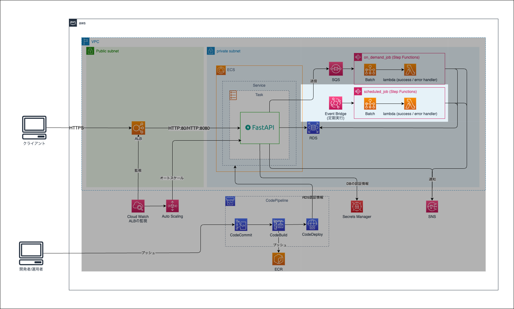

Chapter5 スケジュールジョブ
---
[READMEに戻る](../README.md)

# ■ 1. 作るもの

job_baseモジュールで作成したコンピューティング環境で動作するAWS Batchと、AWS Batch, lambdaを一連の処理として定義するStepFunctions、StepFunctionsを定期実行するEventBridgeの作成を行います。  

スケジュールジョブは、cron的な定期実行の仕組みという位置づけです。



# ■ 2. scheduled_job モジュールの作成

## 1. ファイルの作成

`scheduled_job` モジュールを定義します。

```bash
ENV_NAME="your_name"
mkdir -p ${CONTAINER_PROJECT_ROOT}/terraform/modules/scheduled_job
touch ${CONTAINER_PROJECT_ROOT}/terraform/modules/scheduled_job/{main.tf,variables.tf,outputs.tf,iam.tf}
```

## 2. 入力値・出力値の定義

`terraform/modules/scheduled_job/variables.tf`

```hcl
variable "account_id" {}
variable "app_name" {}
variable "stage" {}

// Batch名
variable "batch_name" {}

// Batch に設定する環境変数
variable "env" { type = map }

// Batchのジョブキュー
variable "batch_job_queue_arn" {}

// Batchで利用するイメージのURI
variable "image_uri" {}

// Batchで利用するイメージのタグ
variable "image_tag" {}

// Batchの実行コマンド
variable "command" { type = list(string) }

// Stepfunctionsで成功処理を行うLambda関数
variable "success_handler_arn" {}

// Stepfunctionsでエラー処理を行うLambda関数
variable "error_handler_arn" {}

// Batchで利用するvCPU数
variable "vcpus" {
  type=string
  default="1"
}

// Batchで利用するメモリサイズ
variable "memory" {
  type=string
  default="2048"
}

// 実行スケジュール (cron形式 or rate形式)
variable "schedule_expression" {}

// StepFunctionsの入力パラメータ
variable "sfn_input" {
  type = map
  default = {"message": "hello"}
}

locals {
  job_name = "${var.app_name}-${var.stage}-${var.batch_name}-ScheduledJob"
}
```

## 3. リソース定義

`terraform/modules/scheduled_job/main.tf`

```hcl
/**
 * ジョブ定義
 */
resource "aws_batch_job_definition" "batch_job_definition" {
  name = local.job_name
  type = "container"
  platform_capabilities = [
    "FARGATE",
  ]

  container_properties = jsonencode({
    environment = [
      for k, v in var.env : {
        name = k
        value = v
      }
    ]
    image = "${var.image_uri}:${var.image_tag}"
    fargatePlatformConfiguration = {
      platformVersion = "1.4.0"
    }
    # ResourceRequirement: https://docs.aws.amazon.com/ja_jp/batch/latest/APIReference/API_ResourceRequirement.html
    resourceRequirements = [
      {
        type = "VCPU"
        value = var.vcpus
      },
      {
        type = "MEMORY"
        value = var.memory
      }
    ],
    jobRoleArn = aws_iam_role.ecs_task_role.arn
    executionRoleArn = aws_iam_role.ecs_task_execution_role.arn

  })
}

/**
 * ステートマシン (Pipeターゲット)
 *
 * ステートメント言語: https://docs.aws.amazon.com/ja_jp/step-functions/latest/dg/concepts-amazon-states-language.html
 *
 * Batch:
 *   https://docs.aws.amazon.com/ja_jp/step-functions/latest/dg/connect-batch.html
 * Lambda:
 *   https://docs.aws.amazon.com/ja_jp/step-functions/latest/dg/connect-lambda.html
 */
// ステートマシン用ロググループ
resource "aws_cloudwatch_log_group" "scheduled_job_log_group" {
  name = "${var.app_name}/${var.stage}/scheduled/${var.batch_name}"
  retention_in_days = 365
}

// https://registry.terraform.io/providers/hashicorp/aws/latest/docs/resources/sfn_state_machine
resource "aws_sfn_state_machine" "scheduled_job" {
  name = local.job_name
  role_arn = aws_iam_role.batch_sfn_role.arn

  logging_configuration {
    log_destination = "${aws_cloudwatch_log_group.scheduled_job_log_group.arn}:*"
    include_execution_data = true
    level = "ALL"
  }

  definition = jsonencode(
    {
      "Comment": "A description of my state machine",
      "StartAt": "ExtractInputParameters",
      "States": {
        // 入力パラメータの抽出
        "ExtractInputParameters": {
          "Type": "Pass",
          "Next": "BatchGroup",
          "Parameters":{
            "metadata": {
              "app_name": var.app_name,
              "stage": var.stage,
              "batch_name": var.batch_name,
              "job_name": local.job_name,
              "command": var.command,
              "vcpus": var.vcpus,
              "memory": var.memory,
              "image_uri": var.image_uri,
              "image_tag": var.image_tag,
              "env": var.env,
            },
            "input.$" : "$"
          },
          // {"metadata": <メタデータ>, "input": <入力パラメータ>} 形式に変換
          "ResultPath": "$"
        },
        // ジョブ実行
        "BatchGroup": {
          "Type": "Parallel",
          "Branches": [
            {
              "StartAt": "Batch",
              "States": {
                // バッチ処理
                "Batch": {
                  "Type": "Task",
                  "Resource": "arn:aws:states:::batch:submitJob.sync",
                  // https://docs.aws.amazon.com/step-functions/latest/dg/connect-batch.html
                  "Parameters": {
                    "JobName": local.job_name,
                    "JobDefinition": "${aws_batch_job_definition.batch_job_definition.arn}",
                    "JobQueue": "${var.batch_job_queue_arn}",
                    // Parameters: https://docs.aws.amazon.com/batch/latest/APIReference/API_SubmitJob.html#Batch-SubmitJob-request-parameters
                    "Parameters": {
                      "sfn_input.$": "$.input"
                    },
                    // ContainerOverrides: https://docs.aws.amazon.com/batch/latest/APIReference/API_ContainerOverrides.html
                    "ContainerOverrides": {
                      "Command": var.command
                    }
                  },
                  // {"metadata": <メタデータ>, "input": <入力パラメータ>, "batch": <バッチ処理の結果>} 形式に変換
                  "ResultPath": "$.batch",
                  "Next": "OnSuccess"
                },
                // 成功ハンドラ
                "OnSuccess": {
                  "Type": "Task",
                  "Resource": "arn:aws:states:::lambda:invoke",
                  "Parameters": {
                    "Payload": {
                      "state.$": "$",  // {"metadata": <メタデータ>, "input": <入力パラメータ>, "batch": <バッチ処理の結果>}
                      "context.$": "$$"  // すべてのコンテキストを渡す
                    },
                    "FunctionName": "${var.success_handler_arn}:$LATEST"
                  },
                  // {"metadata": <メタデータ>, "input": <入力パラメータ>, "batch": <バッチ処理の結果>, "success_handler": <成功ハンドラの結果>} 形式に変換
                  "ResultPath": "$.success_handler",
                  "End": true
                }
              }
            }
          ],
          "Catch": [
            {
              "ErrorEquals": [
                "States.ALL"
              ],
              // {"metadata": <メタデータ>, "input": <入力パラメータ>, "error": <エラー>, ...} 形式に変換
              "ResultPath": "$.error",
              "Next": "ErrorHandler"
            }
          ],
          "End": true
        },
        // エラーハンドラ
        "ErrorHandler": {
          "Type": "Task",
          "Resource": "arn:aws:states:::lambda:invoke",
          "Parameters": {
            "Payload": {
              "state.$": "$",  // すべての入力パラメータを渡す {"metadata": <メタデータ>, "input": <入力パラメータ>, "error": <エラー>, ...}
              "context.$": "$$"  // すべてのコンテキストを渡す
            },
            "FunctionName": "${var.error_handler_arn}:$LATEST"
          },
          // {"metadata": <メタデータ>, "input": <入力パラメータ>, "error": <エラー>, "error_handler": <エラーハンドラの結果>, ...} 形式に変換
          "ResultPath": "$.error_handler",
          "Retry": [
            {
              "ErrorEquals": [
                "Lambda.ServiceException",
                "Lambda.AWSLambdaException",
                "Lambda.SdkClientException"
              ],
              "IntervalSeconds": 2,
              "MaxAttempts": 6,
              "BackoffRate": 2
            }
          ],
          "End": true
        }
      }
    }
  )
}

/**
 * EventBridge scheduler
 */

resource "aws_scheduler_schedule" "this" {
  name       = "${local.job_name}-Scheduler"
  group_name = "default"

  flexible_time_window {
    mode = "OFF"
  }

  // AWS - EventBridge - スケジュールタイプ: https://docs.aws.amazon.com/ja_jp/scheduler/latest/UserGuide/schedule-types.html
  schedule_expression = var.schedule_expression
  schedule_expression_timezone = "Asia/Tokyo"

  target {
    arn      = aws_sfn_state_machine.scheduled_job.arn
    role_arn = aws_iam_role.batch_scheduler_role.arn
    input = jsonencode(var.sfn_input)
  }
  depends_on = [
    aws_iam_role_policy_attachment.attach_target_policy,
  ]
}

```

`terraform/modules/scheduled_job/iam.tf`

```hcl
/*******************************
 * ECSタスク実行ロール
 *******************************/
resource "aws_iam_role" "ecs_task_execution_role" {
  name = "${var.app_name}-${var.stage}-${var.batch_name}-ScheduledJob-EcsTaskExecRole"
  assume_role_policy = data.aws_iam_policy_document.assume_ecs_task_exec_role_policy.json
}

data "aws_iam_policy_document" "assume_ecs_task_exec_role_policy" {
  statement {
    actions = ["sts:AssumeRole"]
    principals {
      type        = "Service"
      identifiers = ["ecs-tasks.amazonaws.com"]
    }
  }
}

resource "aws_iam_role_policy_attachment" "attach_ecs_task_exec_role_policy" {
  role       = aws_iam_role.ecs_task_execution_role.name
  policy_arn = "arn:aws:iam::aws:policy/service-role/AmazonECSTaskExecutionRolePolicy"
}

/*******************************
 * ECSタスクロール
 *******************************/
resource "aws_iam_role" "ecs_task_role" {
  name = "${var.app_name}-${var.stage}-${var.batch_name}-ScheduledJob-EcsTaskRole"
  assume_role_policy = data.aws_iam_policy_document.assume_ecs_task_role_policy.json
}

data "aws_iam_policy_document" "assume_ecs_task_role_policy" {
  statement {
    actions = ["sts:AssumeRole"]
    principals {
      type        = "Service"
      identifiers = ["ecs-tasks.amazonaws.com"]
    }
  }
}

resource "aws_iam_policy" "ecs_task_role_policy" {
  name = "${var.app_name}-${var.stage}-${var.batch_name}-ScheduledJob-EcsTaskRolePolicy"
  policy = jsonencode({
    Version = "2012-10-17"
    Statement = [
      {
        Effect = "Allow",
        Action = [
          "s3:PutObject",
          "s3:GetObject",
          "s3:ListBucket"
        ],
        "Resource" = [
          "*"
        ]
      },
      {
        "Effect": "Allow",
        "Action": [
          "sns:Publish"
        ],
        "Resource": [
          "*"
        ]
      },
      {
        "Effect": "Allow",
        "Action": [
          "secretsmanager:GetSecretValue",
          "secretsmanager:DescribeSecret"
        ],
        "Resource": [
          "arn:aws:secretsmanager:ap-northeast-1:${var.account_id}:secret:/${var.app_name}/*"
        ]
      },
    ]
  })
}

resource "aws_iam_role_policy_attachment" "attach_ecs_task_role_policy" {
  role = aws_iam_role.ecs_task_role.name
  policy_arn = aws_iam_policy.ecs_task_role_policy.arn
}

/**
 * EventBridge Scheduler のロール
 */

resource "aws_iam_role" "batch_scheduler_role" {
  name = "${var.app_name}-${var.stage}-${var.batch_name}-ScheduledJob-PipesRole"
  assume_role_policy = jsonencode({
    "Version": "2012-10-17"
    "Statement": {
      "Effect": "Allow"
      "Action": "sts:AssumeRole"
      "Principal": {
        "Service": "scheduler.amazonaws.com"
      }
    }
  })
}


resource "aws_iam_policy" "batch_scheduler_target_policy" {
  name = "${var.app_name}-${var.stage}-${var.batch_name}-ScheduledJob-SchedulerTargetPolicy"
  policy = jsonencode({
      "Version": "2012-10-17",
      "Statement": [
          {
              "Effect": "Allow",
              "Action": [
                  "states:StartExecution"
              ],
              "Resource": [
                  aws_sfn_state_machine.scheduled_job.arn
              ]
          }
      ]
  })
}

resource "aws_iam_role_policy_attachment" "attach_target_policy" {
  role = aws_iam_role.batch_scheduler_role.name
  policy_arn = aws_iam_policy.batch_scheduler_target_policy.arn
}


/*******************************
 * StepFunctionsロール
 *******************************/
resource "aws_iam_role" "batch_sfn_role" {
  name = "${var.app_name}-${var.stage}-${var.batch_name}-ScheduledJob-BatchSfnRole"
  assume_role_policy = jsonencode({
    "Version": "2012-10-17",
    "Statement": [
      {
        "Effect": "Allow",
        "Principal": {
          "Service": "states.amazonaws.com",
        },
        "Action": "sts:AssumeRole",
      }
    ]
  })
}

# Batch実行権限
resource "aws_iam_policy" "batch_job_management_access_policy" {
  name = "${var.app_name}-${var.stage}-${var.batch_name}-ScheduledJob-BatchJobManagementAccessPolicy"
  policy = jsonencode({
    Version = "2012-10-17"
    Statement = [
      {
        "Effect": "Allow",
        "Action": [
          "batch:TerminateJob",
          "batch:SubmitJob"
        ],
        "Resource": [
          "arn:aws:batch:ap-northeast-1:${var.account_id}:job-queue/${var.app_name}-${var.stage}*",
          "arn:aws:batch:ap-northeast-1:${var.account_id}:job/*",
          "arn:aws:batch:ap-northeast-1:${var.account_id}:job-definition/${var.app_name}-${var.stage}-*:*"
        ]
      },
      {
        "Effect": "Allow",
        "Action": [
          "batch:DescribeJobs",
          "events:PutTargets",
          "events:PutRule",
          "events:DescribeRule"
        ],
        "Resource": "*"
      },
    ]
  })
}

resource "aws_iam_role_policy_attachment" "attach_batch_job_management_access_policy" {
  role = aws_iam_role.batch_sfn_role.name
  policy_arn = aws_iam_policy.batch_job_management_access_policy.arn
}

# lambda実行権限
resource "aws_iam_role_policy_attachment" "attach_invoke_lambda_policy" {
  role       = aws_iam_role.batch_sfn_role.name
  policy_arn = "arn:aws:iam::aws:policy/service-role/AWSLambdaRole"
}

# ログ保存用の権限
resource "aws_iam_policy" "cloud_watch_logs_delivery_full_access_policy" {
  name = "${var.app_name}-${var.stage}-${var.batch_name}-ScheduledJob-CloudWatchLogsDeliveryFullAccessPolicy"
  policy = jsonencode({
    "Version": "2012-10-17",
    "Statement": [
      {
        "Action": [
          "logs:CreateLogDelivery",
          "logs:GetLogDelivery",
          "logs:UpdateLogDelivery",
          "logs:DeleteLogDelivery",
          "logs:ListLogDeliveries",
          "logs:PutResourcePolicy",
          "logs:DescribeResourcePolicies",
          "logs:DescribeLogGroups"
        ],
        "Effect": "Allow",
        "Resource": "*"
      }
    ]
  })
}

resource "aws_iam_role_policy_attachment" "attach_cloud_watch_logs_delivery_full_access_policy" {
  role = aws_iam_role.batch_sfn_role.name
  policy_arn = aws_iam_policy.cloud_watch_logs_delivery_full_access_policy.arn
}


# デフォルトで作成される権限
resource "aws_iam_policy" "xray_access_policy" {
  name = "${var.app_name}-${var.stage}-${var.batch_name}-ScheduledJob-XRayAccessPolicy"
  policy = jsonencode({
    "Version": "2012-10-17",
    "Statement": [
      {
        "Action": [
          "xray:PutTraceSegments",
          "xray:PutTelemetryRecords",
          "xray:GetSamplingRules",
          "xray:GetSamplingTargets"
        ],
        "Effect": "Allow",
        "Resource": "*"
      }
    ]
  })
}

resource "aws_iam_role_policy_attachment" "attach_xray_access_policy" {
  role = aws_iam_role.batch_sfn_role.name
  policy_arn = aws_iam_policy.xray_access_policy.arn
}

```

# ■ 4. 定義したモジュールをエントリーポイントから参照

`terraform/envs/${ENV_NAME}/main.tf`

```hcl
// ... 略 ...

module "crawler_job" {  // < 追加 >
  source              = "../../modules/scheduled_job"
  account_id          = local.account_id
  app_name            = local.app_name
  stage               = local.stage
  batch_name          = "crawler"
  env                 = {
    "STAGE" : local.stage,
    "SNS_ARN": module.base.sns_topic_arn,
    "DB_NAME": local.stage,
    "DB_SECRET_NAME": "/${local.app_name}/${local.stage}/db",
    "JOB_QUEUE_URL": "dummy"
  }
  batch_job_queue_arn = module.job_base.job_queue_arn
  image_uri           = var.app_image_uri
  image_tag           = "latest"
  command             = [
    "python",
    "/opt/app/job/crawler.py",
  ]
  success_handler_arn = module.job_base.success_handler.arn
  error_handler_arn = module.job_base.error_handler.arn
  vcpus               = "1"
  memory              = "2048"
  # https://docs.aws.amazon.com/ja_jp/scheduler/latest/UserGuide/schedule-types.html
  schedule_expression = "rate(5 minutes)"  # 5分おき
}
```

# ■ 5. デプロイ

```bash
cd ${CONTAINER_PROJECT_ROOT}/terraform/envs/${ENV_NAME}

# 初期化
terraform init

# デプロイ内容確認
terraform plan

# デプロイ
terraform apply -auto-approve
```