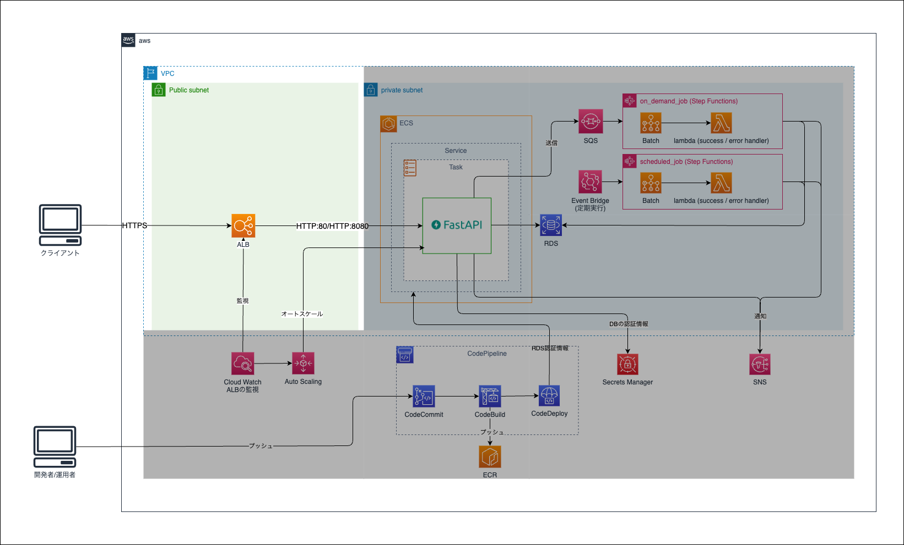

Chapter6 データベース
---
[READMEに戻る](../README.md)

# ■ 1. 作るもの

この章ではECSのオートスケーリング機能を作成します。



# ■ 2. モジュールの作成

ECSリソースを定義する `db` モジュールを定義します。

```bash
mkdir -p terraform terraform/modules/db
(cd terraform/modules/db; touch main.tf variables.tf outputs.tf iam.tf)
```

# ■ 3. 入力値・出力値の定義

`terraform/modules/db/variables.tf`

```hcl
variable "app_name" {}
variable "stage" {}

// データベースを作成するVPC
variable "vpc_id" {}

// データベースを作成するサブネット
variable "subnets" {
  type = list(any)
}

// データベース名
variable "db_name" {}

// データベースのユーザー名
variable "db_user" {}

// データベースのパスワード
variable "db_password" {}

// データベースへのアクセスを許可するCIDRブロック
variable "ingress_cidr_blocks" {
  type = list(string)
}

// データベースのインスタンス数
variable "instance_num" {
  type = number
}

locals {
  // データベースのポート番号
  db_port = 3306
}
```

`terraform/modules/db/variables.tf`

```hcl
output db_secret_manager_arn {
  value = aws_secretsmanager_secret.aurora_serverless_mysql80.arn
}
```

# ■ 4. リソース定義

Aurora Serverless v2 で MySQL8.0 互換のDBクラスタを作成します。


```hcl
/**
 * RDSクラスタ (Aurora Serverless v2)
 * aws_rds_cluster: https://registry.terraform.io/providers/hashicorp/aws/latest/docs/resources/rds_cluster
 * aws_rds_cluster_parameter_group: https://registry.terraform.io/providers/hashicorp/aws/latest/docs/resources/rds_cluster_parameter_group
 */
// Requirements for Aurora Serverless V2 : https://docs.aws.amazon.com/AmazonRDS/latest/AuroraUserGuide/aurora-serverless-v2.requirements.html
resource "aws_rds_cluster" "aurora_serverless_mysql80" {
  cluster_identifier = "${var.app_name}-${var.stage}-aurora-serverless-v2-mysql80-cluster"

  engine = "aurora-mysql"
  // 利用可能なバージョンの一覧
  /*
    aws rds describe-orderable-db-instance-options \
      --engine aurora-mysql \
      --db-instance-class db.serverless \
      --region ap-northeast-1 \
      --query 'OrderableDBInstanceOptions[].[EngineVersion]' \
      --output text
  */
  engine_version = "8.0.mysql_aurora.3.05.0"

  database_name   = var.db_name
  master_username = var.db_user
  master_password = var.db_password
  port            = local.db_port

  db_cluster_parameter_group_name = aws_rds_cluster_parameter_group.aurora_serverless_mysql80.name

  backup_retention_period = 7

  // aws_rds_cluster_instance.db_subnet_group_nameと一致している必要がある
  db_subnet_group_name   = aws_db_subnet_group.aurora_serverless_mysql80.name
  vpc_security_group_ids = [aws_security_group.aurora_serverless_mysql80.id]

  // スケールアップ/ダウン時の最小ACU, 最大ACUを定義
  serverlessv2_scaling_configuration {
    min_capacity = 0.5 // 0.5 ~
    max_capacity = 1.0 // ~ 128
  }

  // 削除時にスナップショットを作成しな時
  skip_final_snapshot = true
  // スナップショットを取得したい場合は final_snapshot_identifier が必要
  #final_snapshot_identifier = "${var.app_name}-${var.stage}-aurora-serverless-v2-mysql80-cluster-final-snapshot-${timestamp()}"

  lifecycle {
    ignore_changes = [
      master_password // パスワードが変更されていても無視する
    ]
    #prevent_destroy = true
  }
}

resource "aws_rds_cluster_parameter_group" "aurora_serverless_mysql80" {
  name   = "${var.app_name}-${var.stage}-aurora-serverless-v2-mysql80-cluster-parameter-group"
  family = "aurora-mysql8.0"

  parameter {
    name         = "time_zone"
    value        = "Asia/Tokyo"
    apply_method = "immediate"
  }
  parameter {
    name  = "character_set_client"
    value = "utf8mb4"
  }
  parameter {
    name  = "character_set_connection"
    value = "utf8mb4"
  }
  parameter {
    name  = "character_set_database"
    value = "utf8mb4"
  }
  parameter {
    name  = "character_set_filesystem"
    value = "binary"
  }
  parameter {
    name  = "character_set_results"
    value = "utf8mb4"
  }
  parameter {
    name  = "character_set_server"
    value = "utf8mb4"
  }
  parameter {
    name  = "collation_connection"
    value = "utf8mb4_bin"
  }
  parameter {
    name  = "collation_server"
    value = "utf8mb4_bin"
  }
}

resource "aws_db_subnet_group" "aurora_serverless_mysql80" {
  name       = "${var.app_name}-${var.stage}-aurora-serverless-v2-mysql80-sg"
  subnet_ids = var.subnets
}

resource "aws_security_group" "aurora_serverless_mysql80" {
  name   = "${var.app_name}-${var.stage}-aurora-serverless-v2-mysql80"
  vpc_id = var.vpc_id
  egress {
    from_port   = 0
    to_port     = 0
    protocol    = "-1"
    cidr_blocks = ["0.0.0.0/0"]
  }
  ingress {
    from_port   = local.db_port
    to_port     = local.db_port
    protocol    = "tcp"
    cidr_blocks = var.ingress_cidr_blocks
  }
  tags = {
    "Name" = "${var.app_name}-${var.stage}-aurora-serverless-v2-mysql80"
  }
}


/**
 * DBインスタンス (Aurora Serverless v2)
 * aws_rds_cluster_instance: https://registry.terraform.io/providers/hashicorp/aws/latest/docs/resources/rds_cluster_instance
 */
resource "aws_rds_cluster_instance" "aurora_serverless_mysql80" {
  // DBインスタンスをいくつ作るか
  // 例)
  //   3 なら wrインスタンス = 1, roインスタンス = 2
  //   5 なら wrインスタンス = 1, roインスタンス = 4
  count              = var.instance_num
  cluster_identifier = aws_rds_cluster.aurora_serverless_mysql80.id
  // Aurora Serverless V2を利用する場合は db.serverless 固定
  instance_class = "db.serverless"
  engine         = aws_rds_cluster.aurora_serverless_mysql80.engine
  engine_version = aws_rds_cluster.aurora_serverless_mysql80.engine_version

  // インスタンスで上書き
  db_parameter_group_name = aws_db_parameter_group.aurora_serverless_mysql80.name
  // クラスタと同じサブネットグループを利用
  db_subnet_group_name = aws_rds_cluster.aurora_serverless_mysql80.db_subnet_group_name
  // パブリックアクセス不可
  publicly_accessible = false
}

resource "aws_db_parameter_group" "aurora_serverless_mysql80" {
  // インスタンスごとに設定したいパラメータグループがある時はこちら
  name   = "${var.app_name}-${var.stage}-aurora-serverless-v2-mysql80-instance-parameter-group"
  family = "aurora-mysql8.0"
}

/**
 * DBのログイン情報を保持する SecretsManager
 * aws_secretsmanager_secret: https://registry.terraform.io/providers/hashicorp/aws/latest/docs/resources/secretsmanager_secret
 */
resource "aws_secretsmanager_secret" "aurora_serverless_mysql80" {
  name                           = "/${var.app_name}/${var.stage}/db"
  recovery_window_in_days        = 0
  force_overwrite_replica_secret = true
}

resource "aws_secretsmanager_secret_version" "aurora_serverless_mysql80" {
  secret_id = aws_secretsmanager_secret.aurora_serverless_mysql80.id
  secret_string = jsonencode({
    db_user     = var.db_user
    db_password = var.db_password
    db_host     = aws_rds_cluster.aurora_serverless_mysql80.endpoint
    db_port     = aws_rds_cluster.aurora_serverless_mysql80.port
  })
}

```

# ■ 5. 定義したモジュールをエントリーポイントから参照する

`terraform/envs/${ENV_NAME}/main.tf`

```hcl
// ... 略 ...

// 変数定義
variable "vpc_id" { type = string }
variable "alb_subnets" { type = list(string) }
variable "subnets" { type = list(string) }
variable "app_image_uri" { type = string }
variable "cicd_artifact_bucket" { type = string }
variable "db_user" { type = string }  // 追加
variable "db_password" { type = string }  // 追加

// ... 略 ...

// 出力
output "alb_host_name" {
  value = module.alb.app_alb.dns_name
}

output "task_definition" {
  value = "${module.app.ecs_task_family}:${module.app.ecs_task_revision}"
}

output db_secret_manager_arn {  // 追加
  value = module.db.db_secret_manager_arn
}

// ... 略 ...

module "db" {  // 追加
  source              = "../../modules/db"
  app_name            = local.app_name
  stage               = local.stage
  vpc_id              = var.vpc_id
  subnets             = var.subnets
  db_name             = local.stage
  db_user             = var.db_user
  db_password         = var.db_password
  ingress_cidr_blocks = [local.vpc_cidr_block]
  instance_num        = 1
}
```

`terraform/envs/${ENV_NAME}/environment.auto.tfvars`

```hcl
// DBのユーザー名
db_user = "sysadmin"

// DBのパスワード
db_password = "sysadmin1234"
```

# ■ 6. デプロイ

```bash
cd terraform/envs/${ENV_NAME}

# 初期化
terraform init

# デプロイ内容確認
terraform plan

# 作成
terraform apply -auto-approve
```

# ■ 7. DBログイン

```bash
# DBの接続情報を取得
DB_SECRETS_MANAGER_ARN=$(terraform output -raw db_secrets_manager_arn)
SECRET_VALUE=$(aws secretsmanager get-secret-value --secret-id arn:aws:secretsmanager:ap-northeast-1:674582907715:secret:/terraformtutorial/dev/db-lWE2Aq | jq -r ".SecretString")
DB_HOST=$(echo $SECRET_VALUE | jq -r ".db_host")
DB_USER=$(echo $SECRET_VALUE | jq -r ".db_user")
DB_PASSWD=$(echo $SECRET_VALUE | jq -r ".db_password")

# ログイン (EC2上で操作していない場合は接続できません)
MYSQL_PWD=$DB_PASSWD mysql -u $DB_USER -h $DB_HOST
```