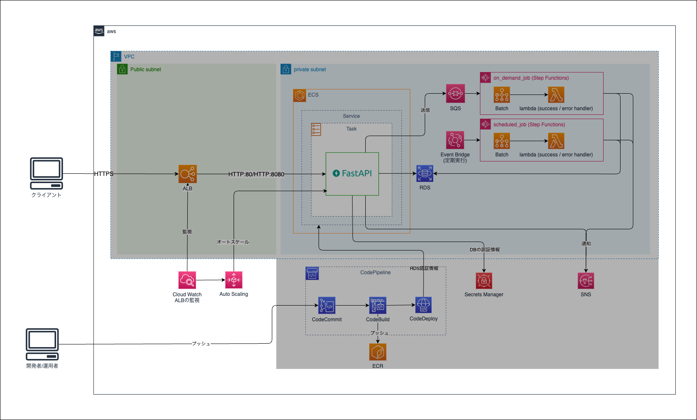
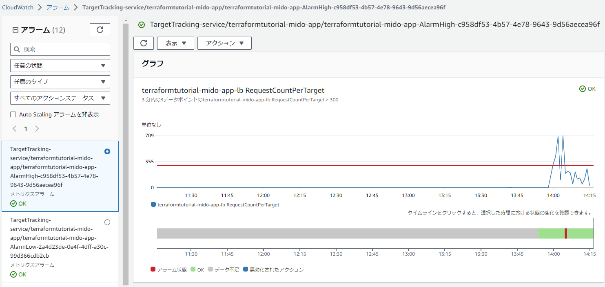
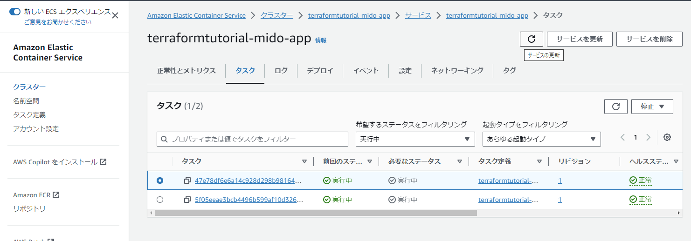

Chapter8 オートスケーリング
---
[READMEに戻る](../README.md)

# ■ 1. 作るもの

この章ではECSのオートスケーリング機能を作成します。



# ■ 2. モジュールの作成

ECSリソースを定義する `monitoring` モジュールを定義します。

```bash
STAGE="ステージ名"
mkdir -p ${CONTAINER_PROJECT_ROOT}/terraform/modules/monitoring
touch ${CONTAINER_PROJECT_ROOT}/terraform/modules/monitoring/{main.tf,variables.tf,outputs.tf,iam.tf}
```

# ■ 3. monitoringモジュールの作成

## 1. 入力値・出力値の定義

`terraform/modules/monitoring/variables.tf`

```hcl
variable "app_name" {}
variable "stage" {}

// ECSクラスタ名
variable "ecs_cluster_name" {}

// ECSサービス名
variable "ecs_service_name" {}

// 本番用ターゲットグループのARNのサフィックス
variable "app_tg_1_arn_suffix" {}

// スタンバイ用ターゲットグループのARNのサフィックス
variable "app_tg_2_arn_suffix" {}

// オートスケーリングの最大台数
variable "max_capacity" {
  type    = number
  default = 20
}

// ターゲット当たりの分間リクエスト数がこの値になるようにオートスケーリングする
variable "avg_request_count_per_target" {
  type    = number
  default = 300  // 秒間5リクエスト
}

```

## 2. リソース定義

### ロールの定義

`terraform/modules/monitoring/iam.tf`

```hcl
/**
 * AutoScaling用role
 */
resource "aws_iam_role" "ecs_autoscaling_role" {
  name = "${var.app_name}-${var.stage}-EcsAutoscalingRole"
  assume_role_policy = jsonencode({
    "Version" : "2012-10-17",
    "Statement" : [
      {
        "Effect" : "Allow",
        "Principal" : {
          "Service" : "ecs.application-autoscaling.amazonaws.com"
        },
        "Action" : "sts:AssumeRole"
      }
    ]
  })
}

resource "aws_iam_policy" "ecs_autoscaling_policy" {
  name = "${var.app_name}-${var.stage}-EcsAutoscalingPolicy"
  policy = jsonencode({
    "Version" : "2012-10-17",
    "Statement" : [
      {
        "Effect" : "Allow",
        "Action" : [
          "ecs:DescribeServices",
          "ecs:UpdateService",
          "cloudwatch:PutMetricAlarm",
          "cloudwatch:DescribeAlarms",
          "cloudwatch:DeleteAlarms"
        ],
        "Resource" : [
          "*"
        ]
      }
    ]
  })
}
```

### オートスケーリングリソース定義

ターゲット当たりの分間リクエスト数を300(`var.avg_request_count_per_target`)程度に保つオートスケーリングの設定を定義します。

`terraform/modules/monitoring/main.tf`

```hcl
/**
 * ECSのオートスケーリング対象設定
 * aws_appautoscaling_target: https://registry.terraform.io/providers/hashicorp/aws/latest/docs/resources/appautoscaling_target
 */
resource "aws_appautoscaling_target" "ecs_appautoscaling_target" {
  // オートスケーリング対象のサービス名を指定
  service_namespace = "ecs"
  // "service/クラスター名/サービス名" 形式で紐付けたいECSのサービスを指定します。
  resource_id = "service/${var.ecs_cluster_name}/${var.ecs_service_name}"
  // オートスケーリングを実行する対象を指定します。
  // https://docs.aws.amazon.com/autoscaling/application/APIReference/API_RegisterScalableTarget.html#autoscaling-RegisterScalableTarget-request-ScalableDimension
  scalable_dimension = "ecs:service:DesiredCount"
  role_arn           = aws_iam_role.ecs_autoscaling_role.arn
  // オートスケーリングさせる時の最小値と最大値です。
  // サーバー台数が無限に増え続けないように事前に上限の設定を行います。
  min_capacity = 1
  max_capacity = var.max_capacity

  depends_on = [
    aws_iam_policy.ecs_autoscaling_policy
  ]
}

/**
 * スケーリングポリシー設定
 * aws_appautoscaling_policy: https://registry.terraform.io/providers/hashicorp/aws/latest/docs/resources/appautoscaling_policy
 *
 * ターゲット当たりの分間リクエスト数を300程度に保つ設定
 * (スケールアウトは3データポイント/3分, スケールインは15データポイント/15分で評価が行われる)
 * TargetTrackingScaling: 指定したメトリクスが指定した数値になるようにスケールアウト/インを行うオートスケール。
 * ECSで通常時とスパイク時のオートスケールを運用する: https://tech.timee.co.jp/entry/2020/08/31/191612
 */
resource "aws_appautoscaling_policy" "ecs_1_policy" {
  name               = "${var.app_name}-${var.stage}-AccessCountTracking"
  policy_type        = "TargetTrackingScaling"
  resource_id        = aws_appautoscaling_target.ecs_appautoscaling_target.resource_id
  scalable_dimension = aws_appautoscaling_target.ecs_appautoscaling_target.scalable_dimension
  service_namespace  = aws_appautoscaling_target.ecs_appautoscaling_target.service_namespace

  // https://registry.terraform.io/providers/hashicorp/aws/latest/docs/resources/appautoscaling_policy#target_tracking_scaling_policy_configuration
  target_tracking_scaling_policy_configuration {
    // 1台あたりの分間リクエスト数を avg_request_count_per_target に保つ
    target_value = var.avg_request_count_per_target
    // スケールインが完了してから、次のスケールインを開始するまでの時間 (秒)
    // スケールインは15データポイントで評価されるが、遅すぎるので5分
    scale_in_cooldown = 300
    // スケールアウトが完了してから、次のスケールアウトを開始するまでの時間 (秒)
    // スケールアウトは3データポイントで評価されるので3分
    scale_out_cooldown = 180

    // Blue/Greenデプロイだと、デプロイの度にターゲットグループが変わるので、tg-1とtg-2のリクエスト数を合計してオートスケールする
    customized_metric_specification {
      // ターゲットグループ1の リクエスト数/ターゲット台数 を取得
      // SELECT SUM(RequestCountPerTarget)
      //   FROM SCHEMA("AWS/ApplicationELB", TargetGroup)
      //   WHERE TargetGroup = 'targetgroup/xxxxxxxxxxx-app-tg-2/xxxxxxxxxxxxxxxx'
      metrics {
        id    = "${var.app_name}_${var.stage}_m1"
        label = "${var.app_name}-${var.stage}-app-tg-1 RequestCountPerTarget"

        metric_stat {
          metric {
            // metric_name, namespaceはCloudWatchのメトリクス画面から確認するのが早い
            namespace   = "AWS/ApplicationELB"
            metric_name = "RequestCountPerTarget"

            // WEHERE句に相当
            dimensions {
              name  = "TargetGroup"
              value = var.app_tg_1_arn_suffix
            }
          }
          // 統計: Average | Minimum | Maximum | SampleCount | Sum
          stat = "Sum"
          // 単位: Percent | Count | None | etc...
          // https://docs.aws.amazon.com/ja_jp/AmazonCloudWatch/latest/APIReference/API_MetricDatum.html
          unit = "None"
        }
        return_data = false
      }

      // ターゲットグループ2の リクエスト数/ターゲット台数 を取得
      // SELECT SUM(RequestCountPerTarget)
      //   FROM SCHEMA("AWS/ApplicationELB", TargetGroup)
      //   WHERE TargetGroup = 'targetgroup/xxxxxxxxxxx-app-tg-2/xxxxxxxxxxxxxxxx'
      metrics {
        id    = "${var.app_name}_${var.stage}_m2"
        label = "${var.app_name}-${var.stage}-app-tg-2 RequestCountPerTarget"

        metric_stat {
          metric {
            namespace   = "AWS/ApplicationELB"
            metric_name = "RequestCountPerTarget"

            dimensions {
              name  = "TargetGroup"
              value = var.app_tg_2_arn_suffix
            }
          }
          stat = "Sum"
          unit = "None"
        }
        return_data = false
      }

      // ターゲットグループ1と2の リクエスト数/ターゲット台数 を合計
      metrics {
        label      = "${var.app_name}-${var.stage}-app-lb RequestCountPerTarget"
        id         = "${var.app_name}_${var.stage}_m3"
        expression = "${var.app_name}_${var.stage}_m1 + ${var.app_name}_${var.stage}_m2"
        // trueのメトリクスがスケールイン/アウトの判断に使われる
        return_data = true
      }
    }
  }
}
```

## ■ 4. 定義したモジュールをエントリーポイントから参照する

`terraform/envs/${STAGE}/main.tf`

```hcl
// ... 略 ...

module "monitoring" {  // < 追加 >
  source              = "../../modules/monitoring"
  app_name            = local.app_name
  stage               = local.stage
  ecs_cluster_name    = module.app.ecs_cluster_name
  ecs_service_name    = module.app.ecs_service_name
  app_tg_1_arn_suffix = module.app.tg_1.arn_suffix
  app_tg_2_arn_suffix = module.app.tg_2.arn_suffix
}
```

# ■ 5. デプロイ

```bash
cd ${CONTAINER_PROJECT_ROOT}/terraform/envs/${STAGE}

# 初期化
terraform init

# デプロイ内容確認
terraform plan

# デプロイ
terraform apply -auto-approve
```

# ■ 6. オートスケールを試してみましょう

ALBに対して大量のリクエストを送信してみる

```bash
# ALBのエンドポイント
ALB_HOST_NAME=$(terraform output -raw alb_host_name)

while :; do curl "http://${ALB_HOST_NAME}/api/healthcheck/" >/dev/null 2>&1 ; done
```

CloudWatchがアラーム状態となり、負荷に応じた数のECSのタスクが新たに起動します。



