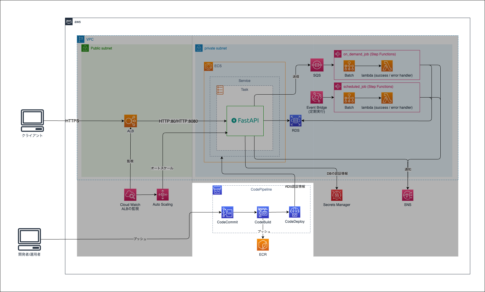
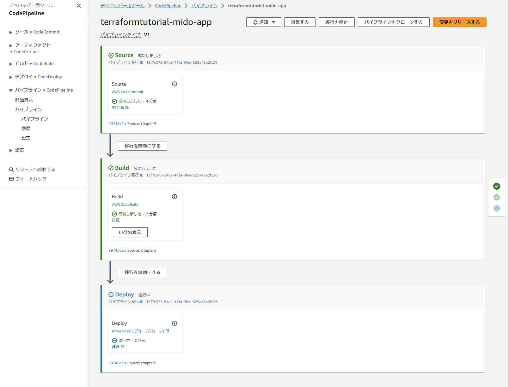
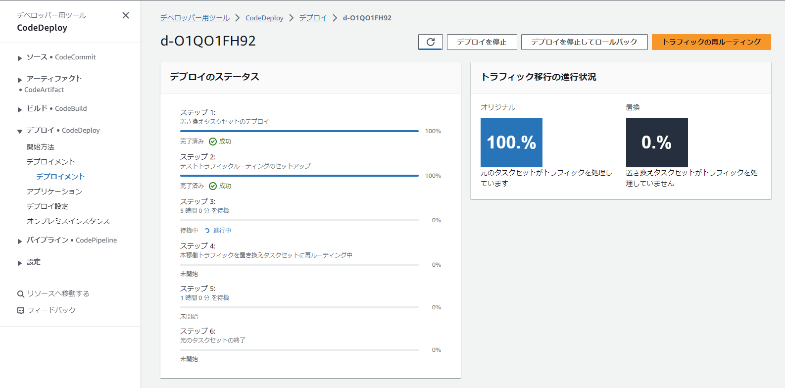
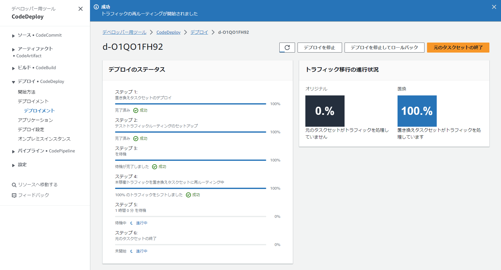
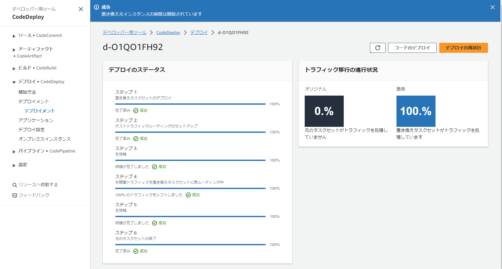

Chapter9 CICD
---
[READMEに戻る](../README.md)

# ■ 1. 作るもの

この章ではECSのオートスケーリング機能を作成します。



# ■ 2. モジュールの作成

ECSリソースを定義する `cicd` モジュールを定義します。

```bash
ENV_NAME="your_name"
mkdir -p ${CONTAINER_PROJECT_ROOT}/terraform/modules/cicd/resources
touch ${CONTAINER_PROJECT_ROOT}/terraform/modules/cicd/{main.tf,variables.tf,outputs.tf,iam.tf}
touch ${CONTAINER_PROJECT_ROOT}/terraform/modules/cicd/resources/buildspec.yml
```

# ■ 3. 入力値・出力値の定義

`terraform/modules/cicd/variables.tf`

```hcl
variable "app_name" {}
variable "stage" {}
variable "aws_region" {}
variable "account_id" {}

// CodeBuildのコンテナを実行するVPC
variable "vpc_id" {}

// CodeBuildのコンテナを実行するサブネット
variable "subnets" { type = list(string) }

// アプリのイメージURI (CodeBuildの環境変数に設定する)
variable "app_image_uri" {}

// ECSのクラスタ名
variable "ecs_cluster_name" {}

// ECSのサービス名
variable "ecs_service_name" {}

// 本番用のターゲットグループ
variable "app_tg_1_name" {}

// スタンバイ用のターゲットグループ
variable "app_tg_2_name" {}

// 本番用のリスナーARN
variable "lb_listener_green_arn" {}

// スタンバイ用のリスナーARN
variable "lb_listener_blue_arn" {}

// CodePipelineのアーティファクトを格納するS3バケット
variable "cicd_artifact_bucket" {}

// ECRのリポジトリ名
variable "repository_name" {}

// ECSのタスク定義名
variable "ecs_task_family" {}
```

# ■ 4. リソース定義

## ロールの定義

`terraform/modules/cicd/iam.tf`

```hcl
/**
 * CodeBuildサービスロール
 */

resource "aws_iam_role" "codebuild_service_role" {
  name = "${var.app_name}-${var.stage}-CodeBuildServiceRole"
  assume_role_policy = jsonencode({
    "Version" : "2012-10-17",
    "Statement" : [
      {
        "Effect" : "Allow",
        "Principal" : {
          "Service" : "codebuild.amazonaws.com"
        },
        "Action" : "sts:AssumeRole"
      }
    ]
  })
  lifecycle {
    # NOTE: CICDアーティファクト用バケットのバケットポリシーのConditionにRoleIdを利用しているので削除してはいけない
    #prevent_destroy = true
  }
}

# CodeBuildサービスロールの作成
# https://docs.aws.amazon.com/ja_jp/codebuild/latest/userguide/setting-up.html#setting-up-service-role
resource "aws_iam_policy" "codebuild_service_policy" {
  name = "${var.app_name}-${var.stage}-CodeBuildServicePolicy"
  policy = jsonencode({
    "Version" : "2012-10-17",
    "Statement" : [
      {
        "Sid" : "CloudWatchLogsPolicy",
        "Effect" : "Allow",
        "Action" : [
          "logs:CreateLogGroup",
          "logs:CreateLogStream",
          "logs:PutLogEvents"
        ],
        "Resource" : [
          "*"
        ]
      },
      {
        "Sid" : "CodeCommitPolicy",
        "Effect" : "Allow",
        "Action" : [
          "codecommit:GitPull"
        ],
        "Resource" : [
          "*"
        ]
      },
      {
        "Sid" : "S3GetObjectPolicy",
        "Effect" : "Allow",
        "Action" : [
          "s3:GetObject",
          "s3:GetObjectVersion"
        ],
        "Resource" : [
          "*"
        ]
      },
      {
        "Sid" : "S3PutObjectPolicy",
        "Effect" : "Allow",
        "Action" : [
          "s3:PutObject"
        ],
        "Resource" : [
          "*"
        ]
      },
      {
        "Sid" : "ECRPullPolicy",
        "Effect" : "Allow",
        "Action" : [
          "ecr:BatchCheckLayerAvailability",
          "ecr:GetDownloadUrlForLayer",
          "ecr:BatchGetImage"
        ],
        "Resource" : [
          "*"
        ]
      },
      {
        "Sid" : "ECRAuthPolicy",
        "Effect" : "Allow",
        "Action" : [
          "ecr:GetAuthorizationToken"
        ],
        "Resource" : [
          "*"
        ]
      },
      {
        "Sid" : "S3BucketIdentity",
        "Effect" : "Allow",
        "Action" : [
          "s3:GetBucketAcl",
          "s3:GetBucketLocation"
        ],
        "Resource" : "*"
      }
    ]
  })
}

resource "aws_iam_role_policy_attachment" "attach_codebuild_service_policy" {
  role       = aws_iam_role.codebuild_service_role.name
  policy_arn = aws_iam_policy.codebuild_service_policy.arn
}

# VPC内でCodeBuildを実行するためのポリシー
# https://docs.aws.amazon.com/ja_jp/codebuild/latest/userguide/auth-and-access-control-iam-identity-based-access-control.html#customer-managed-policies-example-create-vpc-network-interface
resource "aws_iam_policy" "codebuild_for_vpc_policy" {
  name = "${var.app_name}-${var.stage}-CodeBuildForVpcPolicy"
  policy = jsonencode({
    "Version" : "2012-10-17",
    "Statement" : [
      {
        "Effect" : "Allow",
        "Action" : [
          "ec2:CreateNetworkInterface",
          "ec2:DescribeDhcpOptions",
          "ec2:DescribeNetworkInterfaces",
          "ec2:DeleteNetworkInterface",
          "ec2:DescribeSubnets",
          "ec2:DescribeSecurityGroups",
          "ec2:DescribeVpcs"
        ],
        "Resource" : "*"
      },
      {
        "Effect" : "Allow",
        "Action" : [
          "ec2:CreateNetworkInterfacePermission"
        ],
        "Resource" : "arn:aws:ec2:${var.aws_region}:${var.account_id}:network-interface/*",
        "Condition" : {
          "StringEquals" : {
            "ec2:AuthorizedService" : "codebuild.amazonaws.com"
          },
          "ArnEquals" : {
            "ec2:Subnet" : [
              for subnet in var.subnets : "arn:aws:ec2:${var.aws_region}:${var.account_id}:subnet/${subnet}"
            ]
          }
        }
      }
    ]
  })
}

resource "aws_iam_role_policy_attachment" "attach_codebuild_for_vpc_policy" {
  role       = aws_iam_role.codebuild_service_role.name
  policy_arn = aws_iam_policy.codebuild_for_vpc_policy.arn
}

# セッションマネージャーでビルド中のコンテナに接続するためのポリシー
# https://docs.aws.amazon.com/ja_jp/codebuild/latest/userguide/session-manager.html
resource "aws_iam_policy" "codebuild_for_ssm_policy" {
  name = "${var.app_name}-${var.stage}-CodeBuildForSsmPolicy"
  policy = jsonencode({
    "Version" : "2012-10-17",
    "Statement" : [
      {
        "Effect" : "Allow",
        "Action" : [
          "ssmmessages:CreateControlChannel",
          "ssmmessages:CreateDataChannel",
          "ssmmessages:OpenControlChannel",
          "ssmmessages:OpenDataChannel"
        ],
        "Resource" : "*"
      },
      {
        "Effect" : "Allow",
        "Action" : "logs:DescribeLogGroups",
        "Resource" : "arn:aws:logs:${var.aws_region}:${var.account_id}:log-group:*:*"
      },
      {
        "Effect" : "Allow",
        "Action" : [
          "logs:CreateLogStream",
          "logs:PutLogEvents"
        ],
        "Resource" : "arn:aws:logs:${var.aws_region}:${var.account_id}:log-group:${aws_cloudwatch_log_group.codebuild.name}:*"
      }
    ]
  })
}

resource "aws_iam_role_policy_attachment" "attach_codebuild_for_ssm_policy" {
  role       = aws_iam_role.codebuild_service_role.name
  policy_arn = aws_iam_policy.codebuild_for_ssm_policy.arn
}


# そのほか必用なポリシー
resource "aws_iam_policy" "codebuild_for_app_policy" {
  name = "${var.app_name}-${var.stage}-CodeBuildForAppPolicy"
  policy = jsonencode({
    "Version" : "2012-10-17",
    "Statement" : [
      {
        "Effect" : "Allow",
        "Action" : [
          "ecr:CompleteLayerUpload",
          "ecr:InitiateLayerUpload",
          "ecr:PutImage",
          "ecr:UploadLayerPart"
        ],
        "Resource" : [
          "*"
        ]
      },
      {
        "Effect" : "Allow",
        "Action" : [
          "ecs:Describe*"
        ],
        "Resource" : [
          "*"
        ]
      }
    ]
  })
}

resource "aws_iam_role_policy_attachment" "attach_codebuild_for_app_policy" {
  role       = aws_iam_role.codebuild_service_role.name
  policy_arn = aws_iam_policy.codebuild_for_app_policy.arn
}

/**
 * CodeDeployサービスロール
 */
resource "aws_iam_role" "codedeploy_service_role" {
  name = "${var.app_name}-${var.stage}-CodeDeployServiceRole"
  assume_role_policy = jsonencode({
    "Version" : "2012-10-17",
    "Statement" : [
      {
        "Effect" : "Allow",
        "Principal" : {
          "Service" : "codedeploy.amazonaws.com"
        },
        "Action" : "sts:AssumeRole"
      }
    ]
  })
  lifecycle {
    # NOTE: CICDアーティファクト用バケットのバケットポリシーのConditionにRoleIdを利用しているので削除してはいけない
    #prevent_destroy = true
  }
}

resource "aws_iam_role_policy_attachment" "attach_codedeploy_service_role_policy" {
  role       = aws_iam_role.codedeploy_service_role.name
  policy_arn = "arn:aws:iam::aws:policy/AWSCodeDeployRoleForECS"
}


/**
 * CodePipelineサービスロール
 */
resource "aws_iam_role" "codepipeline_service_role" {
  name = "${var.app_name}-${var.stage}-CodePipelineServiceRole"
  assume_role_policy = jsonencode({
    "Version" : "2012-10-17",
    "Statement" : [
      {
        "Effect" : "Allow",
        "Principal" : {
          "Service" : "codepipeline.amazonaws.com",
        },
        "Action" : "sts:AssumeRole",
      }
    ]
  })
  lifecycle {
    # NOTE: CICDアーティファクト用バケットのバケットポリシーのConditionにRoleIdを利用しているので削除してはいけない
    #prevent_destroy = true
  }
}

resource "aws_iam_policy" "codepipeline_service_policy" {
  name = "${var.app_name}-${var.stage}-CodePipelineServicePolicy"
  policy = jsonencode({
    "Version" : "2012-10-17",
    "Statement" : [
      {
        "Action" : [
          "iam:PassRole"
        ],
        "Resource" : "*",
        "Effect" : "Allow",
        "Condition" : {
          "StringEqualsIfExists" : {
            "iam:PassedToService" : [
              "cloudformation.amazonaws.com",
              "elasticbeanstalk.amazonaws.com",
              "ec2.amazonaws.com",
              "ecs-tasks.amazonaws.com"
            ]
          }
        }
      },
      {
        "Action" : [
          "codecommit:CancelUploadArchive",
          "codecommit:GetBranch",
          "codecommit:GetCommit",
          "codecommit:GetUploadArchiveStatus",
          "codecommit:UploadArchive"
        ],
        "Resource" : "*",
        "Effect" : "Allow"
      },
      {
        "Action" : [
          "codedeploy:CreateDeployment",
          "codedeploy:GetApplication",
          "codedeploy:GetApplicationRevision",
          "codedeploy:GetDeployment",
          "codedeploy:GetDeploymentConfig",
          "codedeploy:RegisterApplicationRevision"
        ],
        "Resource" : "*",
        "Effect" : "Allow"
      },
      {
        "Action" : [
          "elasticbeanstalk:*",
          "ec2:*",
          "elasticloadbalancing:*",
          "autoscaling:*",
          "cloudwatch:*",
          "s3:*",
          "sns:*",
          "cloudformation:*",
          "rds:*",
          "sqs:*",
          "ecs:*"
        ],
        "Resource" : "*",
        "Effect" : "Allow"
      },
      {
        "Action" : [
          "lambda:InvokeFunction",
          "lambda:ListFunctions"
        ],
        "Resource" : "*",
        "Effect" : "Allow"
      },
      {
        "Action" : [
          "opsworks:CreateDeployment",
          "opsworks:DescribeApps",
          "opsworks:DescribeCommands",
          "opsworks:DescribeDeployments",
          "opsworks:DescribeInstances",
          "opsworks:DescribeStacks",
          "opsworks:UpdateApp",
          "opsworks:UpdateStack"
        ],
        "Resource" : "*",
        "Effect" : "Allow"
      },
      {
        "Action" : [
          "cloudformation:CreateStack",
          "cloudformation:DeleteStack",
          "cloudformation:DescribeStacks",
          "cloudformation:UpdateStack",
          "cloudformation:CreateChangeSet",
          "cloudformation:DeleteChangeSet",
          "cloudformation:DescribeChangeSet",
          "cloudformation:ExecuteChangeSet",
          "cloudformation:SetStackPolicy",
          "cloudformation:ValidateTemplate"
        ],
        "Resource" : "*",
        "Effect" : "Allow"
      },
      {
        "Action" : [
          "codebuild:BatchGetBuilds",
          "codebuild:StartBuild"
        ],
        "Resource" : "*",
        "Effect" : "Allow"
      },
      {
        "Effect" : "Allow",
        "Action" : [
          "devicefarm:ListProjects",
          "devicefarm:ListDevicePools",
          "devicefarm:GetRun",
          "devicefarm:GetUpload",
          "devicefarm:CreateUpload",
          "devicefarm:ScheduleRun"
        ],
        "Resource" : "*"
      },
      {
        "Effect" : "Allow",
        "Action" : [
          "servicecatalog:ListProvisioningArtifacts",
          "servicecatalog:CreateProvisioningArtifact",
          "servicecatalog:DescribeProvisioningArtifact",
          "servicecatalog:DeleteProvisioningArtifact",
          "servicecatalog:UpdateProduct"
        ],
        "Resource" : "*"
      },
      {
        "Effect" : "Allow",
        "Action" : [
          "cloudformation:ValidateTemplate"
        ],
        "Resource" : "*"
      },
      {
        "Effect" : "Allow",
        "Action" : [
          "ecr:DescribeImages"
        ],
        "Resource" : "*"
      }
    ]
  })
}

resource "aws_iam_role_policy_attachment" "attach_codepipeline_service_policy" {
  role       = aws_iam_role.codepipeline_service_role.name
  policy_arn = aws_iam_policy.codepipeline_service_policy.arn
}

/**
 * CodePipelineのトリガーとして利用するEventBridgeのサービスロール
 */
resource "aws_iam_role" "event_bridge_codepipeline" {
  name = "${var.app_name}-${var.stage}-EventBridgeCodepipelineTrigerRole"
  assume_role_policy = jsonencode({
    "Version" : "2012-10-17",
    "Statement" : [
      {
        "Effect" : "Allow",
        "Principal" : {
          "Service" : "events.amazonaws.com",
        },
        "Action" : "sts:AssumeRole",
      }
    ]
  })
}
resource "aws_iam_policy" "event_bridge_codepipeline_policy" {
  name = "${var.app_name}-${var.stage}-EventBridgeCodepipelineTrigerPolicy"
  policy = jsonencode({
    "Version" : "2012-10-17",
    "Statement" : [
      {
        "Action" : [
          "codepipeline:StartPipelineExecution"
        ],
        "Resource" : [
          "${aws_codepipeline.this.arn}"
        ],
        "Effect" : "Allow"
      }
    ]

  })
}

resource "aws_iam_role_policy_attachment" "attach_event_bridge_codepipeline_policy" {
  role       = aws_iam_role.event_bridge_codepipeline.name
  policy_arn = aws_iam_policy.event_bridge_codepipeline_policy.arn
}
```

## CodeBuildの定義

CodeBuildでは、アプリで利用するdockerイメージをビルドして、ECSにpushするまでを行います。

`terraform/modules/cicd/main.tf`

```hcl
/**
 * 参考
 * - チュートリアル:Amazon ECR ソースと ECS to-デプロイを使用してパイプラインを作成する CodeDeploy
 * https://docs.aws.amazon.com/ja_jp/codepipeline/latest/userguide/tutorials-ecs-ecr-codedeploy.html#tutorials-ecs-ecr-codedeploy-taskdefinition
 */

/**
 * CodeBuild
 * aws_codebuild_project | Terraform:
 *   https://registry.terraform.io/providers/hashicorp/aws/latest/docs/resources/codebuild_project
 * AWS::CodeBuild::Project | CloudFormation:
 *   https://docs.aws.amazon.com/ja_jp/AWSCloudFormation/latest/UserGuide/aws-resource-codebuild-project.html
 */
// CodeBuild用セキュリティグループ
resource "aws_security_group" "codebuild_sg" {
  name   = "${var.app_name}-${var.stage}-app-CodeBuild-sg"
  vpc_id = var.vpc_id
  egress {
    from_port   = 0
    to_port     = 0
    protocol    = "-1"
    cidr_blocks = ["0.0.0.0/0"]
  }

  tags = {
    Name = "${var.app_name}-${var.stage}-app-CodeBuild-sg"
  }
}

// ロググループ
resource "aws_cloudwatch_log_group" "codebuild" {
  name              = "${var.app_name}/${var.stage}/app/codebuild"
  retention_in_days = 365
}

resource "aws_codebuild_project" "this" {
  name          = "${var.app_name}-${var.stage}-app"
  description   = "Build app image and push to ECR"
  build_timeout = 60
  service_role  = aws_iam_role.codebuild_service_role.arn

  artifacts {
    type = "CODEPIPELINE"
  }

  source {
    type            = "CODEPIPELINE"
    git_clone_depth = 0
    buildspec       = file("../../modules/cicd/resources/buildspec.yml")
  }

  environment {
    // BUILD_GENERAL1_SMALL : 3GB memory  2 vCPUs
    // BUILD_GENERAL1_MEDIUM: 7GB memory  4 vCPUs
    // BUILD_GENERAL1_LARGE : 15GB memory 8 vCPUs
    compute_type = "BUILD_GENERAL1_MEDIUM"
    // CodeBuildに用意されているDockerイメージ
    //   https://docs.aws.amazon.com/ja_jp/codebuild/latest/userguide/build-env-ref-available.html
    image                       = "aws/codebuild/amazonlinux2-x86_64-standard:5.0"
    type                        = "LINUX_CONTAINER"
    image_pull_credentials_type = "CODEBUILD"
    // 特権モードでコンテナを起動
    privileged_mode = true

    environment_variable {
      name  = "AWS_ACCOUNT_ID"
      value = var.account_id
    }
    environment_variable {
      name  = "APP_IMAGE_URI"
      value = var.app_image_uri
    }
    environment_variable {
      name  = "ECS_CLUSTER_NAME"
      value = var.ecs_cluster_name
    }
    environment_variable {
      name  = "ECS_SERVICE_NAME"
      value = var.ecs_service_name
    }
    environment_variable {
      name  = "STAGE"
      value = var.stage
    }
  }

  vpc_config {
    vpc_id             = var.vpc_id
    subnets            = var.subnets
    security_group_ids = [aws_security_group.codebuild_sg.id]
  }

  logs_config {
    cloudwatch_logs {
      group_name  = aws_cloudwatch_log_group.codebuild.name
      stream_name = ""
    }
  }
  depends_on = [
    aws_iam_policy.codebuild_service_policy,
    aws_iam_policy.codebuild_for_vpc_policy,
    aws_iam_policy.codebuild_for_ssm_policy,
    aws_iam_policy.codebuild_for_app_policy,
  ]
}
```

## CodeDeployの定義

CodeDeployでは、CodeBuildでpushされたdockerイメージとタスク定義を利用して新しいECSタスクを立ち上げ、Blue/Greenデプロイを実施します。

`terraform/modules/cicd/main.tf`

```hcl
/**
 * CodeDeploy
 *
 * CodeDeployによるBlue-Greenデプロイ:
 *   https://docs.aws.amazon.com/ja_jp/AmazonECS/latest/developerguide/deployment-type-bluegreen.html
 */
resource "aws_codedeploy_app" "this" {
  compute_platform = "ECS"
  name             = "${var.app_name}-${var.stage}-app"
}

// https://registry.terraform.io/providers/hashicorp/aws/latest/docs/resources/codedeploy_deployment_group
resource "aws_codedeploy_deployment_group" "this" {
  app_name = aws_codedeploy_app.this.name
  // トラトラフィックの切り替え方式
  // https://docs.aws.amazon.com/ja_jp/AmazonECS/latest/developerguide/deployment-type-bluegreen.html
  // - CodeDeployDefault.ECSAllAtOnce                    : すべてのトラフィックを切り替え
  // - CodeDeployDefault.ECSLinear10PercentEvery1Minutes : 1分ごとに10%ずつ切り替え
  // - CodeDeployDefault.ECSLinear10PercentEvery3Minutes : 3分ごとに10%ずつ切り替え
  // - CodeDeployDefault.ECSCanary10Percent5Minutes      : 10%を切り替えて、5分後に残りの90%を切り替え
  // - CodeDeployDefault.ECSCanary10Percent15Minutes     : 10%を切り替えて、5分後に残りの90%を切り替え
  deployment_config_name = "CodeDeployDefault.ECSAllAtOnce"
  deployment_group_name  = "${var.app_name}-${var.stage}-app"
  service_role_arn       = aws_iam_role.codedeploy_service_role.arn

  ecs_service {
    cluster_name = var.ecs_cluster_name
    service_name = var.ecs_service_name
  }

  // ALBの設定
  load_balancer_info {
    target_group_pair_info {
      // 本番用のリスナー (HTTPS:443)
      prod_traffic_route {
        listener_arns = [var.lb_listener_green_arn]
      }

      // スタンバイ用のリスナー (HTTP:8080)
      test_traffic_route {
        listener_arns = [var.lb_listener_blue_arn]
      }

      // ターゲットグループ1
      target_group { name = var.app_tg_1_name }
      // ターゲットグループ2
      target_group { name = var.app_tg_2_name }
    }
  }

  // デプロイ方式
  deployment_style {
    // WITH_TRAFFIC_CONTROL or WITHOUT_TRAFFIC_CONTROL
    deployment_option = "WITH_TRAFFIC_CONTROL" // LBを利用したトラフィックの切り替えを行う
    // IN_PLACE or BLUE_GREEN
    deployment_type = "BLUE_GREEN" // Blue/Greenデプロイを行う
  }

  blue_green_deployment_config {
    deployment_ready_option {
      // 10分以内にトラフィックを手動で切り替えなかった場合デプロイが停止する
      action_on_timeout    = "STOP_DEPLOYMENT"
      wait_time_in_minutes = 300
    }
    /*
    deployment_ready_option {
      action_on_timeout = "CONTINUE_DEPLOYMENT"
    }
    */

    // デプロイ成功時のBlue環境の削除設定
    terminate_blue_instances_on_deployment_success {
      action                           = "TERMINATE"
      termination_wait_time_in_minutes = 60
    }
  }

  // デプロイのロールバック設定
  auto_rollback_configuration {
    enabled = true
    // デプロイに失敗したとき
    events = ["DEPLOYMENT_FAILURE"]
  }

}
```

## CodePipelineの定義

CodePipelineには CodeCommitの変更検知 ~ CodeBuild起動 ~ CodeDeployによるBlue/Greenデプロイといった一連の処理をまとめて定義します。

`terraform/modules/cicd/main.tf`

```hcl
/**
 * EventBridge
 * aws_cloudwatch_event_rule: https://registry.terraform.io/providers/hashicorp/aws/latest/docs/resources/cloudwatch_event_rule
 */
// CodeCommitのリポジトリに変更があったときにCodePipelineを起動する
resource "aws_cloudwatch_event_rule" "codepipeline_trigger" {
  name = "${var.app_name}-${var.stage}-codepipeline-trigger"

  event_pattern = jsonencode({
    "source" : ["aws.codecommit"],
    "detail-type" : ["CodeCommit Repository State Change"],
    "resources" : ["arn:aws:codecommit:${var.aws_region}:${var.account_id}:${var.repository_name}"],
    "detail" : {
      "event" : ["referenceCreated", "referenceUpdated"],
      "referenceType" : ["branch"],
      "referenceName" : ["${var.stage}"]
    }
  })
}

resource "aws_cloudwatch_event_target" "codepipeline_trigger" {
  rule     = aws_cloudwatch_event_rule.codepipeline_trigger.name
  arn      = aws_codepipeline.this.arn
  role_arn = aws_iam_role.event_bridge_codepipeline.arn
}

/**
 * CodePipeline
 *
 * CodePipelineの構造
 *   https://docs.aws.amazon.com/ja_jp/codepipeline/latest/userguide/reference-pipeline-structure.html
 */
resource "aws_codepipeline" "this" {
  name     = "${var.app_name}-${var.stage}-app"
  role_arn = aws_iam_role.codepipeline_service_role.arn

  artifact_store {
    location = var.cicd_artifact_bucket
    type     = "S3"
  }

  stage {
    name = "Source"

    // CodeCommit アクションリファレンス:
    // https://docs.aws.amazon.com/ja_jp/codepipeline/latest/userguide/action-reference-CodeCommit.html
    action {
      run_order = 1
      name      = "Source"
      // アクションカテゴリにはSource, Build, Test, Deploy, Approval, Invokeのいずれかを指定する
      // Source: CodeCommit, S3, ECR, etc...
      // Build: CodeBuild, Jenkins, etc...
      // Deploy: CodeDeploy, CloudFormation, etc...
      category         = "Source"
      owner            = "AWS"
      provider         = "CodeCommit"
      version          = "1" // 書き方のバージョン (1で固定)
      output_artifacts = ["SourceArtifact"]

      configuration = {
        // ソースの変更が検出されるリポジトリ
        RepositoryName = var.repository_name
        // ソースの変更が検出されるブランチ名
        BranchName = var.stage
        // ソースの変更はEventBridgeで検出するので、CodePipelineによるポーリングは不要
        PollForSourceChanges = "false"
      }
    }
  }

  stage {
    name = "Build"

    // CodeBuild アクションリファレンス:　
    // https://docs.aws.amazon.com/ja_jp/codepipeline/latest/userguide/action-reference-CodeBuild.html
    action {
      name             = "Build"
      category         = "Build"
      owner            = "AWS"
      provider         = "CodeBuild"
      version          = "1" // 書き方のバージョン (1で固定)
      input_artifacts  = ["SourceArtifact"]
      output_artifacts = ["BuildArtifact"]

      configuration = {
        ProjectName = aws_codebuild_project.this.name
      }
    }
  }

  stage {
    name = "Deploy"

    // ECS Blue-Greenデプロイ用 CodeDeploy アクションリファレンス:　
    //   https://docs.aws.amazon.com/ja_jp/codepipeline/latest/userguide/action-reference-ECSbluegreen.html
    action {
      name      = "Deploy"
      category  = "Deploy"
      owner     = "AWS"
      provider  = "CodeDeployToECS"
      region    = var.aws_region
      run_order = 1
      version   = "1"
      // ECSのローリングアップデートとブルー/グリーンデプロイで利用するファイルの比較
      //   https://dev.classmethod.jp/articles/ecs-deploytype-files/#toc-8
      #
      // Blue-Greenデプロイの入力として必要なファイルは
      // imageDetail.json, taskdef.json, appspec.yamlの3つ
      input_artifacts = ["BuildArtifact"]

      configuration = {
        // CodeDeployアプリケーション
        ApplicationName = aws_codedeploy_app.this.name
        // ECSサービスに設定されているデプロイグループ
        DeploymentGroupName = aws_codedeploy_deployment_group.this.app_name
        // タスク定義ファイル(taskdef.json)を提供する入力アーティファクトの名前 (ソースアクションの出力アーティファクト名)
        TaskDefinitionTemplateArtifact = "BuildArtifact"
        // AppSpecファイル(appspec.yaml)を提供する入力アーティファクトの名前 (ソースアクションの出力アーティファクト名)
        AppSpecTemplateArtifact = "BuildArtifact"
        // イメージ定義ファイル(imageDetail.json)を提供する入力アーティファクトの名前 (ソースアクションの出力アーティファクト名)
        Image1ArtifactName = "BuildArtifact"
        // taskdef.json内で利用できるプレースホルダを定義。
        // taskdef.json内でこのプレースホルダを利用すると、imageDetail.jsonのImageURIに置換される。
        Image1ContainerName = "IMAGE1_NAME"
      }
    }
  }

  depends_on = [
    aws_iam_policy.codepipeline_service_policy
  ]

}
```

`terraform/modules/cicd/resources/buildspec.yml`

```yml
# buildspecの構文
#   https://docs.aws.amazon.com/ja_jp/codebuild/latest/userguide/build-spec-ref.html#build-spec-ref-syntax
#
# ビルド環境の環境変数 | AWS
#   https://docs.aws.amazon.com/ja_jp/codebuild/latest/userguide/build-env-ref-env-vars.html
#
# ECSのローリングアップデートとブルー/グリーンデプロイで利用するファイルの比較 | DevelopersIO
#   https://dev.classmethod.jp/articles/ecs-deploytype-files/
#
# セッションマネージャーでビルドコンテナに接続する方法
#   https://docs.aws.amazon.com/ja_jp/codebuild/latest/userguide/session-manager.html
#
# DockerイメージをECRにプッシュする方法
#   https://docs.aws.amazon.com/ja_jp/AmazonECR/latest/userguide/docker-push-ecr-image.html
version: 0.2
phases:
  pre_build:
    commands:
      # ECRログイン
      - echo Logging in to Amazon ECR...
      - aws --version
      - echo $AWS_DEFAULT_REGION
      - aws ecr get-login-password --region $AWS_DEFAULT_REGION | docker login --username AWS --password-stdin ${AWS_ACCOUNT_ID}.dkr.ecr.${AWS_DEFAULT_REGION}.amazonaws.com
      # jqインストール
      - yum install -y jq
      # イメージタグ作成
      - COMMIT_HASH=$(echo $CODEBUILD_RESOLVED_SOURCE_VERSION | cut -c 1-7)
      - IMAGE_TAG=${COMMIT_HASH:=latest}
      - echo $IMAGE_TAG
  build:
    commands:
      - echo Build started on `date`
      - echo Building the Docker image...
      - |
        docker build --rm \
          -f docker/app/Dockerfile \
          -t ${APP_IMAGE_URI}:latest \
          .
      - docker tag $APP_IMAGE_URI:latest $APP_IMAGE_URI:$IMAGE_TAG
  post_build:
    commands:
      - echo Build completed on `date`
      - docker push $APP_IMAGE_URI:latest
      - docker push $APP_IMAGE_URI:$IMAGE_TAG
      # Amazon ECS Blue/Green デプロイアクションに必要なファイルを生成
      - printf '{"ImageURI":"%s"}' $APP_IMAGE_URI:$IMAGE_TAG > imageDetail.json
      - cat tfexports/${STAGE}/appspec.yaml > appspec.yaml
      - cat tfexports/${STAGE}/taskdef.json > taskdef.json
      # 確認
      - cat appspec.yaml
      - cat taskdef.json
      - cat imageDetail.json
artifacts:
  files:
    # Amazon ECS Blue/Green デプロイアクション用の imageDetail.json ファイル
    #   https://docs.aws.amazon.com/ja_jp/codepipeline/latest/userguide/file-reference.html#file-reference-ecs-bluegreen
    - imageDetail.json
    # appspec.yaml の <TASK_DEFINITION> に展開されるタスク定義
    #   https://docs.aws.amazon.com/ja_jp/codepipeline/latest/userguide/tutorials-ecs-ecr-codedeploy.html#tutorials-ecs-ecr-codedeploy-taskdefinition
    - taskdef.json
    # AppSpecAmazon ECS デプロイメントのファイル構造
    #   https://docs.aws.amazon.com/ja_jp/codedeploy/latest/userguide/reference-appspec-file-structure.html#ecs-appspec-structure
    - appspec.yaml
```

# ■ 5. 定義したモジュールをエントリーポイントから参照する

buildspec.ymlの出力アーティファクトである appspec.yml と taskdef.json を生成するリソースを定義します。  
terraformでこれらのファイルを生成することにより、「イメージは最新だけど、古いタスク定義でデプロイされてしまった」みたいな事故を防ぐことができます。

`terraform/envs/${ENV_NAME}/main.tf`

```hcl
// ... 略 ...

// 変数定義
variable "vpc_id" { type = string }
variable "alb_subnets" { type = list(string) }
variable "subnets" { type = list(string) }
variable "app_image_uri" { type = string }
variable "cicd_artifact_bucket" { type = string }  // 追加

// ローカル変数を定義
locals {
  aws_region      = data.aws_region.current.name
  account_id      = data.aws_caller_identity.self.account_id
  app_name        = replace(lower("terraformtutorial"), "-", "")
  stage           = "mido"
  vpc_cidr_block  = "10.53.0.0/16"
  env = {
    "APP_NAME" : local.app_name,
    "STAGE" : local.stage,
  }
  repository_name = "xxxxxxxxxxxxxxxxxx"  // 追加
}

// ... 略 ...

module "cicd" { // 追加
  source                = "../../modules/cicd"
  app_name              = local.app_name
  stage                 = local.stage
  aws_region            = local.aws_region
  account_id            = local.account_id
  vpc_id                = var.vpc_id
  subnets               = var.subnets
  app_image_uri         = var.app_image_uri
  ecs_cluster_name      = module.app.ecs_cluster_name
  ecs_service_name      = module.app.ecs_service_name
  app_tg_1_name         = module.app.tg_1.name
  app_tg_2_name         = module.app.tg_2.name
  lb_listener_green_arn = module.app.listener_green.arn
  lb_listener_blue_arn  = module.app.listener_blue.arn
  cicd_artifact_bucket  = var.cicd_artifact_bucket
  repository_name       = local.repository_name
  ecs_task_family       = module.app.ecs_task_family
}

resource "null_resource" "make_dir" {
  # https://registry.terraform.io/providers/hashicorp/null/latest/docs/resources/resource
  triggers = {
    always_run = timestamp()
  }
  provisioner "local-exec" {
    command = "mkdir -p ../../../tfexports/${local.stage}"
  }
}

# appspec.ymlを作成
resource "local_file" "appspec_yml" {
  # https://registry.terraform.io/providers/hashicorp/local/latest/docs/resources/file
  filename = "../../../tfexports/${local.stage}/appspec.yaml"
  content  = <<EOF
version: 0.0
Resources:
  - TargetService:
      Type: AWS::ECS::Service
      Properties:
        TaskDefinition: <TASK_DEFINITION>
        LoadBalancerInfo:
          ContainerName: "${module.app.container_name}"
          ContainerPort: ${module.app.container_port}
        PlatformVersion: "1.4.0"
EOF

  depends_on = [null_resource.make_dir]
}

# taskdef.jsonを作成
resource "null_resource" "run_script" {
  # https://registry.terraform.io/providers/hashicorp/null/latest/docs/resources/resource
  triggers = {
    always_run = timestamp()
  }
  provisioner "local-exec" {
    command = <<EOF
aws ecs describe-task-definition \
  --task-definition ${module.app.ecs_task_family}:${module.app.ecs_task_revision} \
  --query 'taskDefinition' \
  --output json |
jq -r '.containerDefinitions[0].image="<IMAGE1_NAME>"' \
> ../../../tfexports/${local.stage}/taskdef.json
EOF
  }
  depends_on = [null_resource.make_dir]
}
```

`terraform/envs/${ENV_NAME}/environment.auto.tfvars`

```hcl
// CodePipeline用アーティファクト保存バケット
cicd_artifact_bucket = "xxxxxxxxxxxxxxx"
```

# ■ 6. デプロイ

```bash
cd ${CONTAINER_PROJECT_ROOT}/terraform/envs/${ENV_NAME}

# 初期化
terraform init

# デプロイ内容確認
terraform plan

# デプロイ
terraform apply -auto-approve
```

# ■ 7. CodePipelineによるアプリのデプロイ

`terraform apply` を実施すると、 `tfexports/${ENV_NAME}` 配下に `appspec.yml` , `taskdef.json` といったCodeDeployで利用されるファイルが生成されます。  
このファイルをcommitし、EventBridgeで監視しているブランチにpushします。

```bash
git add .
git commit -m "tfexports"
git push codecommit main:${ENV_NAME}
```

pushするとEventBridgeがCodePipelineをキックします。  
CodeDeployまで進んだら、「詳細」をクリックしましょう。



CodeDeployの画面に進むと、Blue/Greenデプロイの管理画面が表示されます。  
デプロイのステータスがステップ2まで進むと、スタンバイ用のALBリスナー(8080)からデプロイ中のコンテナにアクセスすることができますので、ブラウザでアクセスしてみましょう。  
(`terraform output alb_host_name` で出力されるURLに8080ポートを指定してアクセスしてみましょう)

http://xxxxxxxxxxxxxxxxxxxxxxxxxxxxxxxxxxxxxxxxx.ap-northeast-1.elb.amazonaws.com:8080/

問題なくアクセスできるようであれば「トラフィックの再ルーティング」をクリックし、本番用のリスナー(80)がデプロイ中のコンテナに向くようになります。




デプロイのステータスがステップ4まで進むと、本番用のリスナー(80)がデプロイ中のコンテナに向いた状態になります。
「元のタスクセットの終了」をクリックすると、古いコンテナを終了させることができます。



デプロイのステータスがステップ6まで完了したら、デプロイ完了です。

